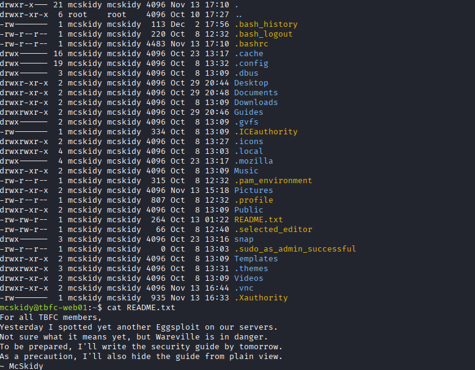
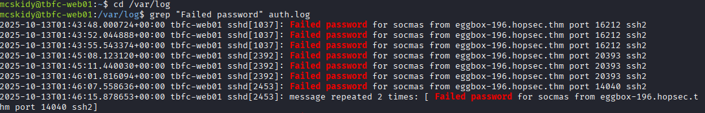

# Dia 1 - Linux CLI - Shell Bells

  

### Objetivo

El objetivo de la primera habitacion del evento esta enfocado a la terminal de Linux, a navegar por directorios o listar archivos detro de un directorio incluido los archivos ocultos con ls -la

### Navegando por el desafio

El desafio en si no presenta ninguna dificultad, es una habitacion que explica que hace cada comando y le muestra al usuario que tiene que hacer despues para responder las preguntas, de esta forma se completo el desafio mientras se respondian las preguntas
encontrando las flags, ya sea listando archivos y archivos ocultos en un directorio, utilizando grep para encontrar informacion especifica en un archivo o viendo la informacion de bash de un usuario en su .bash_history.

Es una buena maquina para aprender sobre los comandos basicos en linux, estos comandos sera de gran utilidad en el futuro para los principiantes que quieren adentrarse mas en el mundo de la ciberseguridad debido a que Linux es el OS mas utilzado en esta area.

  
  
  

### Lecciones aprendidas

- Cada usuario dentro su directorio /home contiene un archivo que muestra el historial de bash, llamado .bash_history
- La importancia de utilizar grep para encontrar informacion especifica en un archivo sin la necesidad de perderse dentro de archivos con grandes volumenes de datos

### Nota

La maquina presenta una "side quest" para aquellos usuarios con un nivel mas intermedio, el write-up de dicha side quest se subira tiempo despues de haber finalizado el evento