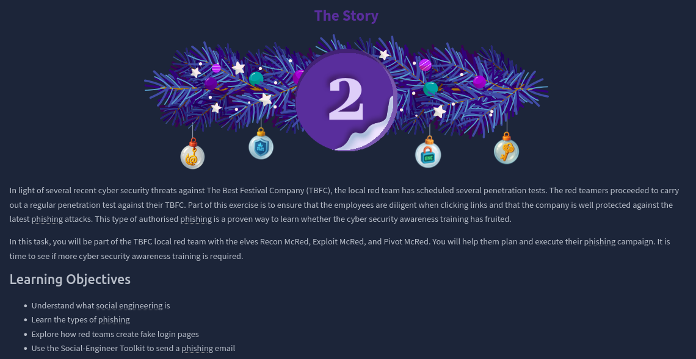
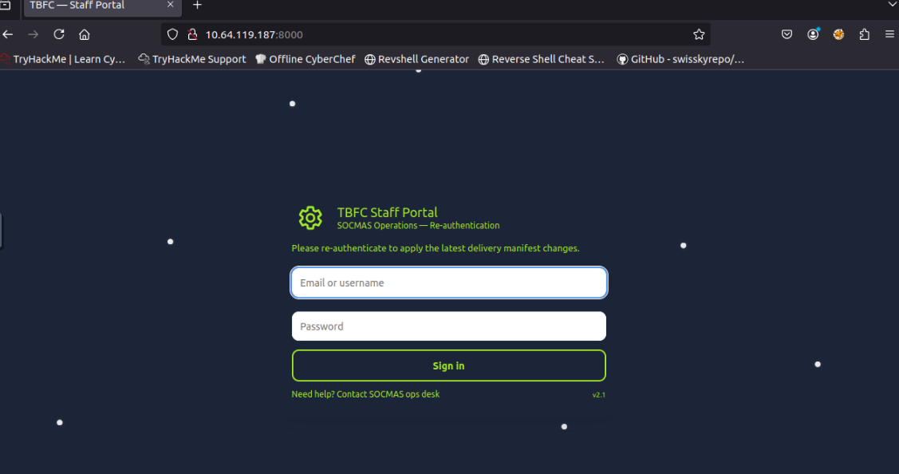
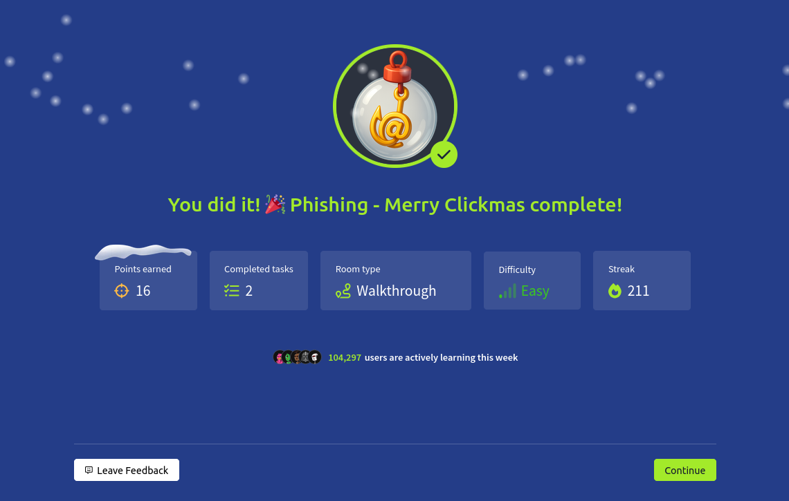

# Dia 2 - Phishing - Merry Clickmas

  

### Objetivo

El objetivo de esta habitacion es enseñar a los usuarios sobre los ataques de ingenieria social o mas en especifico, ataques "Phishing", estos ataques dependen de que la victima realice una "accion", esta accion puede ser dar click, abrir un mensaje/correo, descargar algo, etc.

### Navegando por el desafio

En esta habitacion el usuario va a estar en un caso donde es parte del Red Team, el cual va a probar la concientizacion de la empresa objetivo sobre los ataques phishing, le va a enseñar al usuario como se realizan estos ataques, las consecuencias que podrian causar y como evitar o detectar un posible phishing.

Por ejemplo, algunos puntos a tomar en cuenta cuando se tiene un posible phishing:

- Sospechoso?
- El email/mensaje me dice que le de click a algo?
- Me ofrece algo que quiero?
- Me incita a hacer algo ahora o me provoca un sentimiento de urgencia?

Que hacer en estos casos?

- Mantén la calma. Los atacantes buscan generar adrenalina o urgencia para que actúes sin pensar.
- No uses los enlaces incluidos en el mensaje, introduce la URL manualmente en el navegador, preferiblemente analiza la URL bajo alguna herramienta como Virus Total.
- No abras archivos adjuntos o enlaces que no estabas esperando. Primero verifica la legitimidad del mensaje.
- Revisa quién envió el mensaje realmente. No te fíes del nombre que se muestra; verifica la dirección completa o número real.

A partir de aqui, la pagina guia al usuario sobre como realizar un ataque phishing, para este caso ya la habitacion le da al usuario un index.html de un login falso mas un script en python llamado server.py que se encarga de montar un servidor http y el manejo de captura de creedenciales, asi el usuario simplemente se centra en realizar los pasos correctamente.

Ademas, la habitacion le presenta al usuario la herramienta Social-Engineering Toolkit o SET, la cual es una herramienta diseñada para ataques de ingenieria social, en este caso el usuario la va a utilizar para enviar diseñar y enviar el correo con la URL del login phishing.

  
  
  

### Lecciones aprendidas

- Que hacer y que no hacer si recibimos un correo/mensaje y se sospecha que es un ataque phishing
- Las consecuencias que pueden tener estos ataques