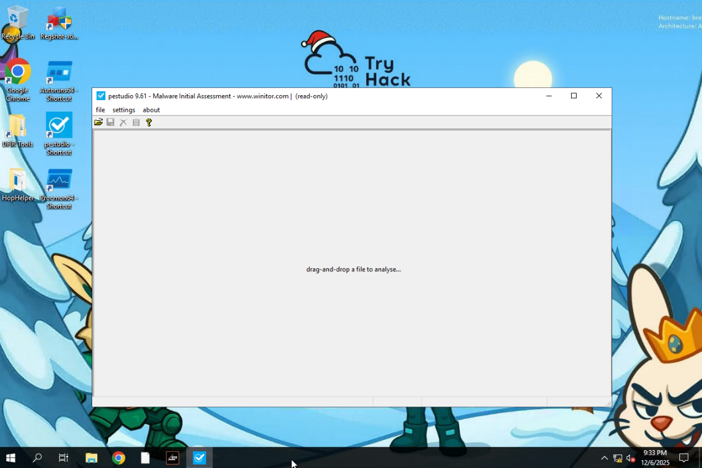
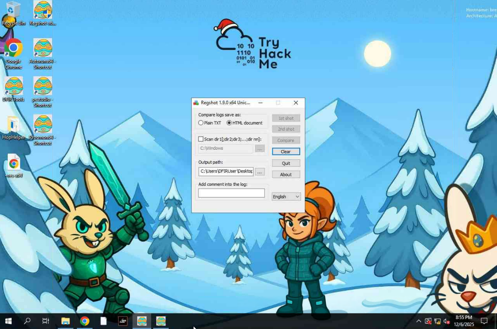
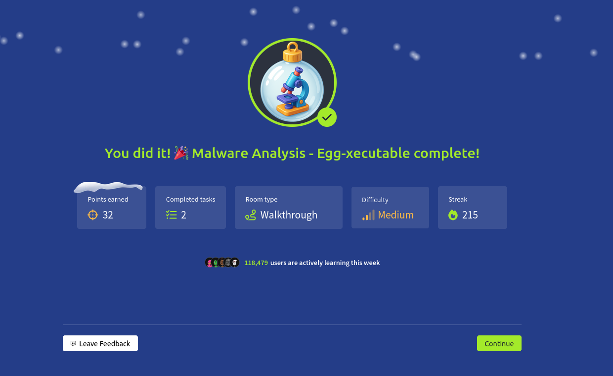

# Dia 6 - Malware Analysis - Egg-xecutable

  

### Objetivo

Este dia se vuelve a enfocar en el apartado de la ciberseguridad defensiva, en este caso el usuario tendra el objetivo de analizar un posible malware, la habitacion cubrira los siguientes puntos de aprendizaje:

- Los principios de analisis de malware
- Introduccion a sandbox
- Analisis estaticos vs dinamicos
- Herramientas como PeStudio, ProcMon y Regshot

### Navegando por el desafio

La habitación inicia explicando los fundamentos del analisis de malware desde una perspectiva defensiva, el usuario asume el rol de un analista SOC que debe investigar un archivo sospechoso encontrado, antes de comenzar con el analisis, se hace enfasis en un principio clave:

Nunca ejecutar muestras en un entorno real, ya que incluso archivos pequeños pueden provocar daños, persistencia u obtener acceso remoto al sistema, por eso se introducen las sandboxes y máquinas virtuales como entornos seguros para estudiar malware sin riesgos.

Despues, el desafio explica la diferencia entre los dos enfoques principales del analisis de malware:

- Analisis estatico, que permite estudiar un archivo sin ejecutarlo, observando sus caracteristicas internas como strings, imports, funciones o indicadores de ofuscación.

- Análisis dinámico, que consiste en ejecutar el archivo en un entorno controlado y observar cómo se comporta en tiempo real como archivos creados, cambios en el registro, procesos nuevos o conexiones de red.

Una vez entendida la teoría, la habitación guía al usuario a su primera herramienta, PeStudio, que sirve para realizar analisis estatico de ejecutables, al abrir el archivo sospechoso, se pueden observar datos relevantes como hashes, secciones del PE, strings incrustados, librerías importadas y recursos, incluso antes de ejecutar el malware, estas pistas ya permiten identificar comportamientos maliciosos, por ejemplo:

- IPs sospechosas
- comandos ocultos o APIs que el malware podría utilizar para persistencia o evasion.

  

Tras el analisis estatico, comienza la fase de analisis dinámico, el desafío introduce dos herramientas fundamentales, Regshot, para detectar cambios en el registro de Windows antes y después de ejecutar el malware, y ProcMon, que permite monitorear llamadas a archivos, procesos, claves del registro y mas, ambas herramientas son esenciales para descubrir qué intenta hacer el archivo al ejecutarse y cómo afecta el sistema.

  

  

A medida que se ejecuta el archivo dentro del entorno seguro, el usuario puede observar indicadores claros de actividad maliciosa, creación de claves en el registro relacionadas con persistencia, intentos de ejecutarse nuevamente tras el reinicio del sistema, modificación de archivos, o llamadas sospechosas en ProcMon que delatan su intención de mantenerse activo o comunicarse hacia afuera.

La habitacion tambien enseña una practica esencial para analistas, diferenciar cambios legitimos del sistema de los realizados por el malware, para ello, Regshot genera dos snapshots del registro y destaca unicamente las diferencias, facilitando la identificación de las claves que el malware crea o modifica, ProcMon, por su parte, permite aplicar filtros para aislar la actividad exacta del proceso investigado entre miles de eventos del sistema.

Finalmente, el desafio guía al usuario a recopilar y correlacionar toda la informacion obtenida mediante el analisis estatico y dinamico para comprender completamente el comportamiento del malware, el objetivo es que el usuario aprenda a detectar mecanismos de persistencia, rutas de archivos utilizados, claves modificadas y cualquier actividad sospechosa dentro del sistema, con todo esto, la habitacion concluye reforzando la importancia de los entornos seguros, el uso de herramientas de analisis y la metodologia estructurada para investigar malware de manera eficaz.

  

### Lecciones Aprendidas

- Importancia del analisis seguro, ejecutar cualquier archivo sospechoso en un entorno real es un riesgo enorme, el analisis de malware siempre debe hacerse en maquinas virtuales o sandboxes aisladas.

- Diferencias entre analisis estatico y dinamico
El analisis estático permite descubrir información valiosa como hashes, strings, imports, secciones del ejecutable sin necesidad de ejecutar el archivo, el analisis dinámico complementa esto mostrando lo que el malware realmente hace al correr como procesos creados, cambios en el registro y archivos modificados.

- El valor de las herramientas de analisis, herramientas como PeStudio, ProcMon y Regshot permiten visualizar tanto la estructura interna del binario como su comportamiento en tiempo real, facilitando descubrir patrones maliciosos como persistencia o manipulación del sistema.

- Identificacion de indicadores de compromiso (IOCs): aprender a detectar strings sospechosas, rutas, claves de registro o llamadas a funciones maliciosas es clave para documentar malware y generar reportes utiles para el equipo SOC.

- Persistencia y comportamiento del malware, el análisis dinamico evidencia como muchos ejecutables maliciosos intentan sobrevivir reinicios, modificar claves criticas o ejecutarse de forma oculta, reforzando la importancia de monitorear actividad del sistema.

- Correlacion de datos, una buena practica en analisis de malware es combinar resultados del analisis estatico y dinamico para obtener una vision completa del comportamiento del archivo, evitando conclusiones basadas en una sola técnica.