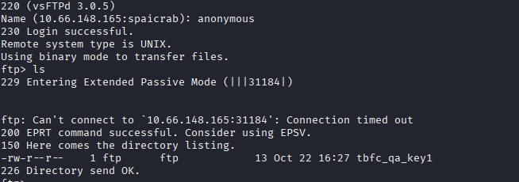
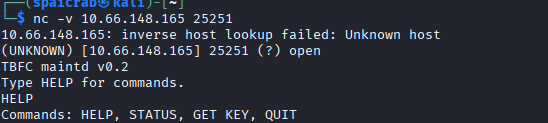

# Dia 7 - Network Discovery - Scan-ta Clause

  

### Objetivo

En este dia la habitacion se enfoca mas en servicios de red y su descubrimiento con ayuda de herramienas como nmap, en esta habitacion tiene el objetivo de:

- Aprender lo basico de descubrimiento de servicios de red con nmap
- Aprender los protocolos de red mas imporantes y sus conceptos
- Aplicar el conocimiento en el desafio de este dia

### Navegando por el desafio

El desafio comienza planteando la situacion del caso, los atacantes ha comprometido el servidor de QA, bloqueando el acceso y dejando la infraestructura del SOC-mas en pausa, la mision del usuario es identificar los servicios expuestos, descubrir las claves ocultas y finalmente recuperar el control del servidor, para ello, la habitacion guia paso a paso al usuario a traves del reconocimiento activo en la red mediante herramientas como Nmap, Netcat, FTP y consultas DNS.

  

La primera etapa consiste en comprender la importancia del descubrimiento de servicios, aunque el servidor esta comprometido, sigue respondiendo en su direccion IP, lo que permite realizar un escaneo inicial para identificar puertos abiertos, con un simple nmap <ip>, el usuario observa los puertos mas comunes, encontrando unicamente SSH (22) y HTTP (80), Esto permite deducir que todavia existe un servidor web accesible, aunque este se ve alterado con un mensaje dejado por los atacantes.

  

La habitacion enfatiza que los puertos comunes no siempre son suficientes, por eso se necesita de un escaneo mas completo usando -p- para cubrir los 65 535 puertos TCP y --script=banner para intentar identificar que servicios estan realmente detras de cada puerto, este escaneo revela dos servicios adicionales, un servidor FTP corriendo en un puerto no estandar (21212) y una aplicacion personalizada llamada TBFC maintd escuchando en el puerto 25251. el usuario aprende asi que los servicios pueden ser movidos intencionalmente a puertos inusuales para esconderlos, aunque siguen siendo detectables mediante una enumeracion adecuada.

  

La habitacion guia al usuario a conectarse al servidor FTP utilizando modo anonimo, revelando un archivo que contiene el primer fragmento de las claves necesarias para recuperar el acceso al panel administrador, despues, para interactuar con el servicio desconocido en el puerto 25251, se utiliza Netcat, demostrando su utilidad para comunicarse con aplicaciones no estandar, ejecutando el comando adecuado dentro del servicio, se obtiene la segunda clave oculta.

  

  

El desafio luego introduce la importancia de los puertos UDP, destacando que muchos usuarios olvidan escanearlos, al usar nmap -sU, se muestran el puerto 53/UDP abierto, correspondiente a un servicio DNS, aprovechando la herramienta dig, la cual es un comando en Linux para consultar servidores DNS, obtener informacion detallada sobre dominios, diagnosticar problemas de red y realizar búsquedas especificas de registros DNS de forma flexible, ofreciendo mas detalles que herramientas antiguas como nslookup y permitiendo interactuar directamente con servidores especificos, asi el usuario realiza una consulta de tipo TXT hacia un dominio interno, obteniendo asi la tercera clave necesaria.

Con los tres fragmentos de la clave, el usuario regresa al sitio web comprometido y accede al panel secreto donde puede ingresar los valores combinados, el panel proporciona acceso a una consola interna donde ya no es necesario escanear desde fuera, ya que se pueden listar los servicios en ejecucion directamente usando ss -tunlp, esto muestra los mismos puertos identificados en los escaneos que ya se hicieron pero tambien muestra servicios internos disponibles solo desde localhost, como MySQL en el puerto 3306.

  

La habitacion enseña al usuario a aprovechar este acceso local para enumerar la base de datos sin necesidad de credenciales, utilizando el cliente MySQL local para consultar la tabla flags y obtener finalmente la bandera del reto, la habitacion termina reforzando la importancia del reconocimiento de red como una habilidad esencial, mostrando como varios servicios pueden esconder secretos en distintos protocolos y puertos, y como cada herramienta desempeña un rol para reconstruir el acceso al servidor comprometido.

  

### Leccions aprendidas

- La enumeracion de puertos es la base de todo analisis, un escaneo rapido no es suficiente, usar -p- garantiza descubrir servicios ocultos o fuera de los puertos estandar.

- Los servicios no siempre estan donde deberian, protocolos como FTP, SSH o HTTP pueden ejecutarse en puertos inusuales, por lo que nunca se debe asumir nada sin verificarlo.

- La deteccion de versiones con es clave, conocer que servicio y que version corre en cada puerto permite identificar vectores de ataque potenciales.

- Un puerto abierto no siempre significa un servicio util, pero siempre es un punto que debe revisarse para entender su proposito o descartar riesgos.

- La enumeracion es un proceso iterativo, un primer escaneo sirve como mapa general, pero se complementa con escaneos mas especificos y scripts de Nmap para ampliar la informacion.

- Conocer los protocolos comunes ayuda a interpretar los resultados, saber que comportamiento esperar de servicios como SSH, HTTP o servicios personalizados permite detectar anomalias.

- Descubrir un servicio personalizado puede ser la clave del reto, ya que muchas veces la “entrada real” no esta en los servicios tipicos sino en aquellos desarrollados especificamente para el escenario.