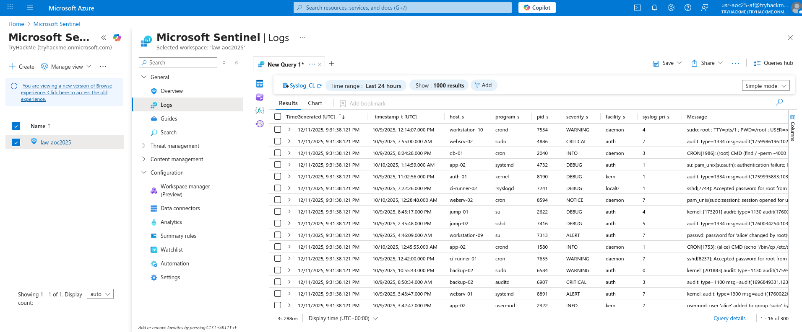
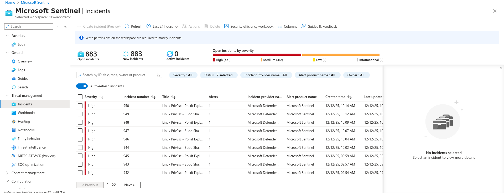
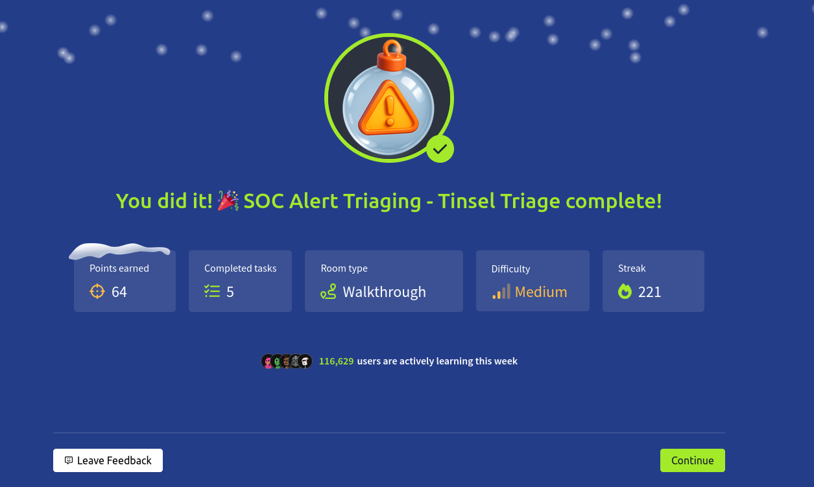

# Dia 10 - SOC Alert Triaging - Tinsel Triage

  

### Objetivo

Este dia se enfoca en uno de los aspectos mas criticos dentro del trabajo de un equipo de seguridad, el triage y la priorizacion de alertas dentro de un SOC, el objetivo principal es que el usuario comprenda como analizar alertas de forma estructurada, evitando reaccionar impulsivamente ante cada evento y aprendiendo a distinguir entre señales reales de compromiso y ruido operativo.

El contenido introduce al usuario al uso de Microsoft Sentinel como plataforma central en la que se reciben, investigan y correlacionan alertas, a traves del desafio, se busca que el usuario aprenda a interpretar informacion procedente de diferentes fuentes de logs, revisar la evidencia asociada a cada alerta y determinar si la actividad mostrada corresponde a un incidente real, un falso positivo o comportamiento esperado.

- Entender la imporancia de alerta triage y priorizacion
- Explorar microsoft sentinel para revisar y analizar alertas
- Correlacionar logs para identificar actividades reales y determinar veredictos de alertas

### Navegando por el desafio

La habitacion comienza explicando el tema del que se hablo antes, el Alert Triage, es un tema importante que ayuda a los analistas a tener un metodo consistente para revisar y analizar alertas de posibles ataques y asi saber cual de todas las alertas necesita prioridad y total uso de recursos, las dimensiones del triage se pueden resumir en los siguientes puntos:

- Servidad: Que tan mal?
- Time: Cuando?
- Contexto: En que etapa se encuentra el ataque?
- Impacto: Quien o que se ha visto afectado?

Luego de identificar que alertas necesitan total atencion, se explican los siguientes puntos para investigar y relacionar de forma efectiva las alertas:

- Investigar la alerta en detalle.
Abrir la alerta y revisar las entidades, los datos del evento y la logica de deteccion, confirmar si la actividad representa un comportamiento realmente malicioso.

- Revisar los registros relacionados.
Examinar las fuentes de logs relevantes, buscar patrones o acciones inusuales que coincidan con la alerta.

- Correlacionar multiples alertas.
Identificar otras alertas que involucren al mismo usuario, direccion IP o dispositivo, la correlacion suele revelar una secuencia de ataque mas amplia o actividad coordinada.

- Construir contexto y una linea de tiempo.
Combinar marcas de tiempo, acciones del usuario y activos afectados para reconstruir la secuencia de eventos, esto ayuda a determinar si el ataque sigue en curso o si ya fue contenido.

- Decidir la accion a seguir.
Si hay indicadores de compromiso, escalar al equipo de respuesta a incidentes, investigar mas si se necesita evidencia adicional o mayor correlacion, cerrar o suprimir la alerta si es un falso positivo confirmado, y actualizar las reglas de deteccion segun corresponda.

- Documentar hallazgos y lecciones aprendidas.
Mantener un registro claro del analisis, las decisiones y los pasos de remediacion, una buena documentacion fortalece los procesos del SOC y apoya la mejora continua.

Luego de esto, la habitacion guia al usuario en la parte practica en donde tiene que ingresar al entorno SOC dentro de Azure para aplicar el proceso de triage usando Microsoft Sentinel, desde el panel de Incidents, se revisan las alertas generadas, comenzando por las de mayor severidad, una de las primeras investigadas es la alerta Linux PrivEsc – Kernel Module Insertion, donde se analizan los eventos asociados, las entidades afectadas y la clasificacion de la alerta.

  

  

Sentinel permite ver la linea de tiempo del incidente y detectar otros eventos relacionados, lo que ayuda a identificar si varias alertas forman parte de una misma intrusion, un ejemplo es cuando la misma maquina genera alertas como Root SSH Login, SUID Discovery y Kernel Module Insertion, lo que indica una cadena de ataque desde acceso inicial hasta persistencia.

Luego, se muestra la evidencia revisando los eventos directamente desde los logs, usando consultas KQL, se analizan los registros del host comprometido, donde se observan acciones sospechosas como la creacion de copias del shadow file, la modificacion de usuarios con privilegios y la instalacion del modulo malicioso, la correlacion de estos eventos confirma actividad anomala y posible escalamiento de privilegios.

  

### Lecciones aprendidas

- Priorizar alertas por severidad, contexto y posible impacto evita perder tiempo en ruido y permite concentrar los esfuerzos en amenazas reales.

- Detecciones aisladas pueden parecer eventos menores, pero al relacionarlas por entidad, usuario o host, se revela una posible cadena de ataque que abarca acceso inicial, escalacion de privilegios y persistencia.

- Revisar los eventos reales desde Sentinel y usar consultas KQL permite confirmar acciones sospechosas, identificar patrones y obtener una vision precisa de lo que ocurrio en el sistema.

- Ordenar los eventos cronologicamente ayuda a comprender como evoluciono el ataque y que pasos realizo el atacante antes y despues de ser detectado.

- Determinar cuando una alerta no representa una amenaza real permite ajustar reglas de deteccion y mejorar la eficiencia del SOC.

- Registrar hallazgos, decisiones y conclusiones garantiza que otros analistas puedan entender el caso, reproducir el analisis o aplicar mejoras futuras.