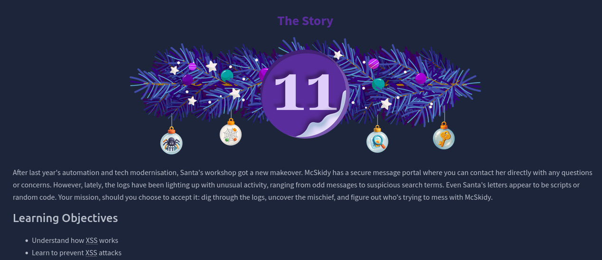
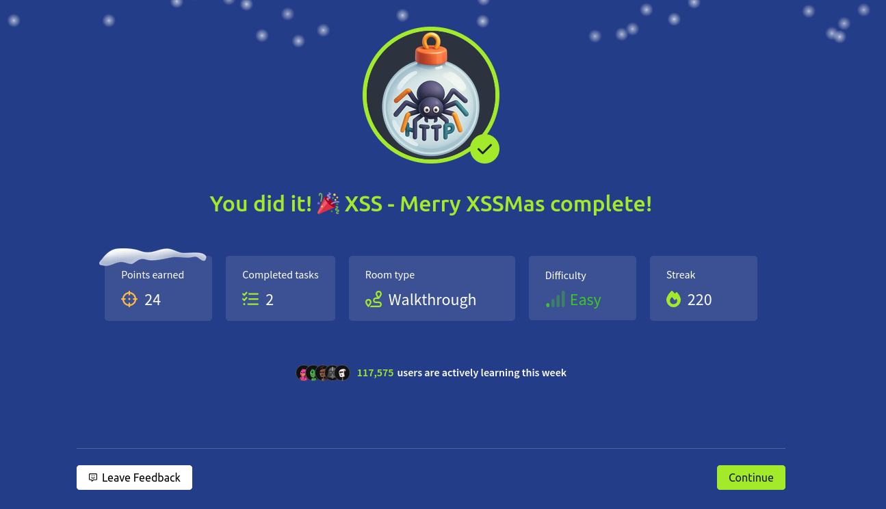

# Dia 11 - XSS - Merry XSSMas

  

### Objetivo

El dia 11 se enfoca en comprender y explotar vulnerabilidades de Cross-Site Scripting (XSS), una de las fallas mas comunes en aplicaciones web, el objetivo principal es que el usuario aprenda como funciona XSS, como puede ser aprovechado por un atacante, y que medidas se deben aplicar para evitar que codigo malicioso sea ejecutado dentro de un sitio.

Durante el desafio se exploran las variantes mas comunes de XSS, tanto Reflected como Stored, demostrando como entradas no validadas pueden ser usadas para ejecutar JavaScript en el navegador de la victima

### Navegando por el desafio

La teoria del dia 11 se enfoca en entender la vulnerabilidad de Cross-Site Scripting (XSS), una de las fallas mas comunes en aplicaciones web, XSS ocurre cuando un sitio permite que un atacante inyecte codigo malicioso, generalmente JavaScript, en campos de entrada que luego se muestran a otros usuarios sin ser validados ni escapados correctamente, esto provoca que el navegador ejecute el codigo como si fuera legitimo, lo que permite acciones maliciosas como robar cookies, modificar paginas o suplantar usuarios.

Se explican dos tipos principales de XSS:

- Reflected XSS:
La carga maliciosa se refleja inmediatamente en la respuesta del servidor, normalmente se explota mediante enlaces manipulados, comunmente usados en ataques de phishing, el navegador interpreta la inyeccion como parte del sitio y ejecuta el codigo al instante.

- Stored XSS:
El codigo malicioso se almacena en el servidor, por ejemplo en una base de datos, y se ejecuta cada vez que cualquier usuario visita el contenido afectado, es mas peligroso porque no requiere que cada victima interactue con un enlace, asi el ataque persiste y se activa de forma automatica.

Tambien se describe el impacto de XSS, incluyendo robo de sesiones, ventanas falsas para capturar credenciales y alteracion visual o funcional de la pagina.

Finalmente, se presentan las practicas clave para prevenir XSS, como lo son:

- Evitar propiedades inseguras como innerHTML y preferir textContent ya que esta propiedad trata al input como texto y lo convierte a HTML.

- Configurar cookies con atributos seguros como HttpOnly, Secure y SameSite.

- Sanitizar y codificar todos los datos proporcionados por los usuarios para eliminar o escapar contenido potencialmente ejecutable.

Luego de esto la habitacion guia al usuario al hacer los 2 tipos de ataques XSS en la pagina web dada al principio para conseguir las flags y completar la habitacion

  

  

### Lecciones aprendidas

- Cualquier verificacion hecha en el navegador puede ser facilmente manipulada, por eso la validacion real siempre debe hacerse del lado del servidor, con XSS queda claro que confiar en la entrada del usuario es uno de los mayores riesgos.

- El navegador no distingue si un script proviene del usuario o del sistema, simplemente lo ejecuta, esto permite entender por que XSS es tan poderoso y por que las defensas deben implementarse en la aplicacion, no en el cliente.

- La diferencia entre XSS reflejado y almacenado demuestra que algunos ataques requieren interaccion de la victima, mientras que otros pueden persistir y afectar a muchos usuarios sin accion adicional.

- Con XSS, un atacante puede robar cookies si no estan protegidas, atributos como HttpOnly, Secure y SameSite se vuelven esenciales para mitigar robo de sesiones, la seguridad de la sesion no depende solo del servidor, sino tambien de como el navegador maneja dichas cookies.

- XSS demuestra que un solo fallo en sanitizacion, validacion o configuracion puede comprometer todo el sistema, la leccion final es que la seguridad debe considerarse en cada capa, tanto entrada, almacenamiento, visualizacion, sesiones y navegadores.