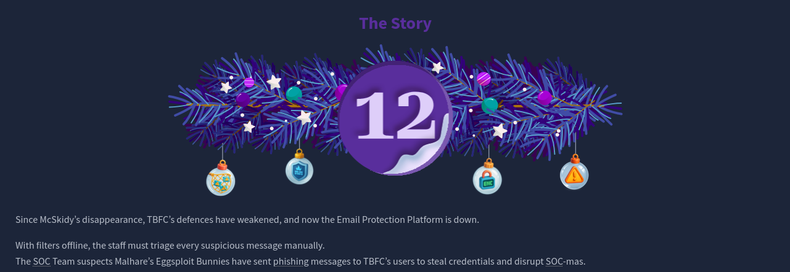
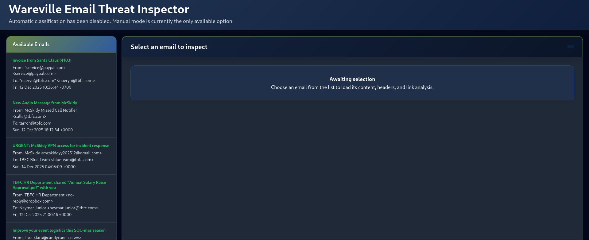
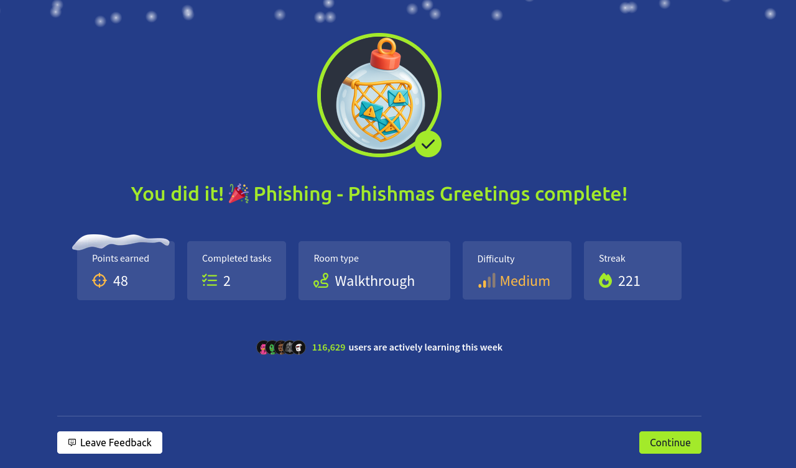

# Dia 12 - Phishing - Phishmas Greetings

  

### Objetivo

En este dia el enfoque vuelve a ser phishing, pero en este caso en vez de realizar un ataque phishing ahora le toca al usuario defenderse en contra de estos, en esta habitacion el usuario aprendera mas en profundidad sobre phishing y al final se le daran diferentes correos para determinar si son legitimos o son correos phishing, los objetivos de este dia son:

- Saber como identificar un email phishing
- Aprender las tecnicas de pishing mas populares
- Entender la diferencia entre spam y phishing

### Navegando por el desafio

La habitacion muestra un escenario corporativo donde los atacantes tratan de comprometer a la empresa mediante correos cuidadosamente diseñados, luego de esto la habitacion muestra las diferentes tecnicas mas usadas del phishing moderno con el objetivo de crear mensajes precisos que buscan robar credenciales, fraude financiero o exfiltracion de datos, se analizan casos practicos y tecnicas habituales:

- Impersonacion: correos que simulan venir de empleados, departamentos o servicios internos.

- Ingenieria social: uso de urgencia, amenaza o persuacion para que la victima actue sin verificar.

- Typosquatting y punycode: dominios muy similares o con caracteres Unicode para engañar la vista.

- Spoofing y fallos en autenticacion: como identificar SPF/DKIM/DMARC rotos en los headers.

- Adjuntos maliciosos: archivos que al abrirse ejecutan codigo (ej. HTA/HTML) o desencadenan descargas.

- Uso de aplicaciones legitimas: enlaces a servicios de almacenamiento compartido (OneDrive, Dropbox) que facilitan el engaño y suelen pasar filtros.

Hoy en dia los atacantes prefieren mover a las victimas fuera del entorno corporativo hacia paginas de login falsas o servicios legitimos manipulados para capturar credenciales.

Phishing es una tecnica de ataque basada en engaño humano que busca obtener credenciales, instalar malware o provocar fraude financiero, no es lo mismo que spam, el spam es ruido masivo sin intencion directa de robo, mientras que el phishing es una operacion dirigida y persuasiva, entre las señales saber si un mensaje o correo es phishing estan: 

- Remitente no coincidente con el dominio corporativo, 
- Uso de dominios parecidos o punycodes. 
- Solicitudes de accion urgente.
- Enlaces a dominios no autorizados. 
- Adjuntos con extensiones peligrosas y headers de correo que muestran fallos en SPF/DKIM/DMARC. 

Los atacantes modernos usan servicios legitimos para ocultar sus intenciones y canales laterales (SMS, mensajeria, llamadas) para continuar la estafa fuera del correo.

Luego de la explicacion de las diferentes tecnicas y estrategias que los atacantes usan para hacer parecer sus correos de phishing como legitimo, la habitacion proporciona un sitio web con diferentes correos, el usuario tiene que determinar si el correo es spam o es phishing y en caso de ser phishing tiene que justificar y seleccionar que tecnicas utiliza el correo.

  

  

### Lecciones aprendidas

- Verificar remitente siempre, mirar el dominio real y los headers (Return-Path, Authentication-Results) para detectar suplantacion.

- SPF/DKIM/DMARC importan, fallos en estas comprobaciones son indicadores fuertes de spoofing.

- No confiar en la apariencia, punycode y typosquatting permiten dominios visualmente identicos.

- Adjuntos sospechosos requieren precaucion extrema, archivos .html, .hta u otros pueden ejecutar codigo fuera del sandbox.

- Desconfia de la urgencia, el lenguaje que presiona a actuar rapido es una tecnica comun de ingenieria social.

- Servicios legitimos pueden ser la trampa, enlaces a plataformas de comparticion no implican legitimidad del contenido.

- Mover la conversacion fuera del canal puede ser señal de fraude, si un remitente insiste en seguir via WhatsApp/SMS, verificar la identidad por canales oficiales.

- Educacion y procedimientos reducen riesgos, formacion continua, listas de dominios oficiales y comprobacion de procesos para validar solicitudes reducen el exito del phishing.