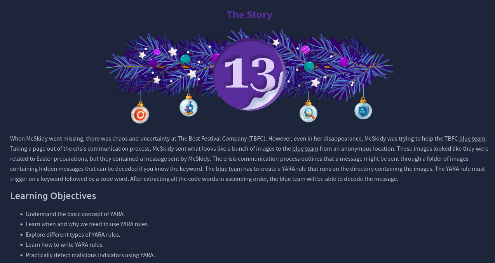
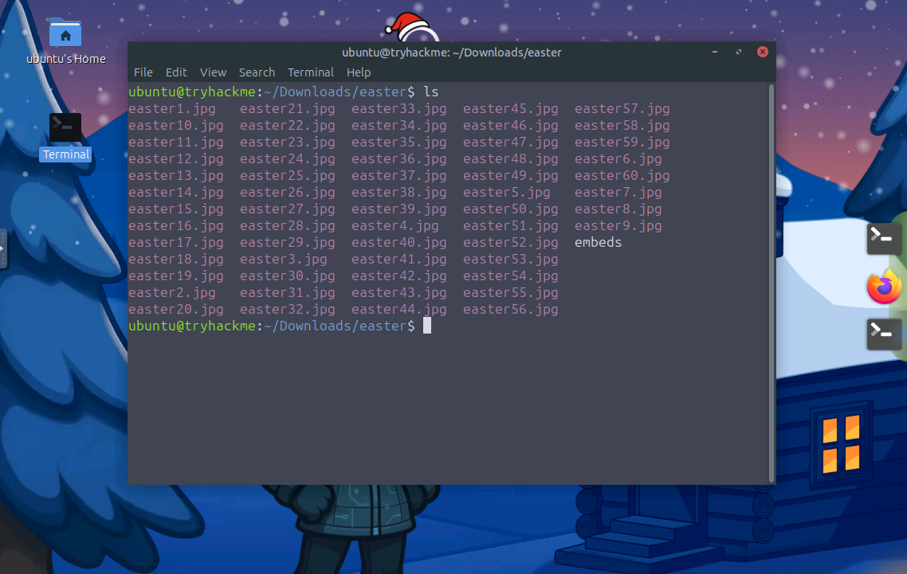

# Dia 13 - YARA Rules - YARA mean one!

  

### Objetivo

El objetivo del desafio del dia 13 es comprender el uso de YARA como herramienta de deteccion y analisis dentro de un contexto de respuesta a incidentes, a traves de este escenario, se busca que el usuario entienda como YARA permite identificar patrones ocultos en archivos aparentemente inofensivos, utilizando reglas personalizadas basadas en strings, expresiones regulares y condiciones logicas, se busca que el usuario entienda:

- Comprender el concepto basico de YARA.

- Aprender cuando y por que es necesario usar reglas YARA.

- Explorar los diferentes tipos de reglas YARA.

- Aprender a escribir reglas YARA.

- Detectar de forma practica indicadores maliciosos usando YARA.

### Navegando por el desafio

El desafio se desarrolla en la deteccion basada en firmas, donde YARA actua como un motor de busqueda avanzado capaz de escanear grandes volumentes de archivos en busca de patrones especificos, a lo largo del escenario, se explora como los atacantes pueden ocultar informacion o indicadores dentro de archivos comunes, y como los defensores pueden contrarrestar estas tecnicas mediante reglas bien definidas.

Se introduce la estructura fundamental de una regla YARA, compuesta por metadata, strings y condiciones, explicando como cada componente contribuye a una deteccion precisa, el desafio tambien muestra la importancia de seleccionar correctamente el tipo de string a utilizar, ya sea texto plano, hexadecimal o expresiones regulares, dependiendo del comportamiento que se desea identificar.

YARA es una herramienta utilizada por equipos de seguridad para identificar y clasificar amenazas mediante la busqueda de patrones especificos dentro de archivos, procesos o memoria, en lugar de basarse unicamente en nombres o hashes, YARA permite detectar comportamientos y fragmentos caracteristicos del codigo malicioso, lo que la hace especialmente util frente a malware ofuscado o variantes nuevas.

Una regla YARA se compone principalmente de strings y condiciones, los strings representan los indicadores que se desean detectar, como palabras clave, patrones binarios o expresiones regulares, mientras que las condiciones definen la logica que determina cuando una coincidencia debe considerarse valida, esta combinacion permite crear reglas flexibles y precisas, reduciendo falsos positivos y mejorando la deteccion.

YARA es ampliamente utilizada en actividades de threat hunting, analisis post incidente y deteccion proactiva, ya que permite a los analistas definir sus propios criterios de deteccion y aplicar reglas tanto locales como compartidas por la comunidad, su capacidad para escanear grandes volumentes de datos y encontrar patrones ocultos la convierte en una herramienta clave para los equipos blue team durante investigaciones de seguridad.

Al final de la habitacion el usuario utilizando lo aprendido en la habitacion tendra que crear su propia regla YARA para buscar el string "TBFC:" en los diferentes jpgs dentro de la maquina y conseguir la flag para completar el desafio.

  

  

### Lecciones aprendidas

- Las reglas YARA permiten a los analistas definir de forma precisa que consideran malicioso, adaptandose a nuevas amenazas y variantes.

- Una buena regla YARA debe combinar correctamente strings y condiciones para reducir falsos positivos y mejorar la efectividad.

- El uso de modificadores como nocase, wide, xor o base64 ayuda a detectar contenido ofuscado que los atacantes utilizan para evadir defensas.

- Aplicar YARA en escenarios como threat hunting, analisis post-incidente y escaneo de archivos permite identificar indicadores que otras herramientas pueden pasar por alto.