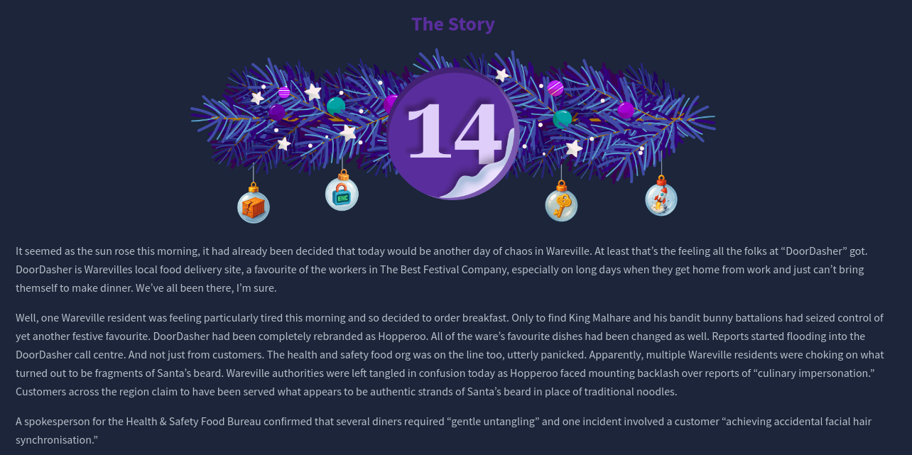
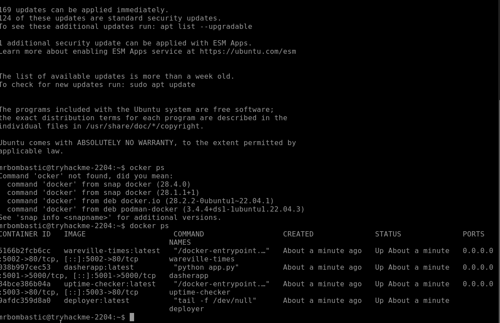
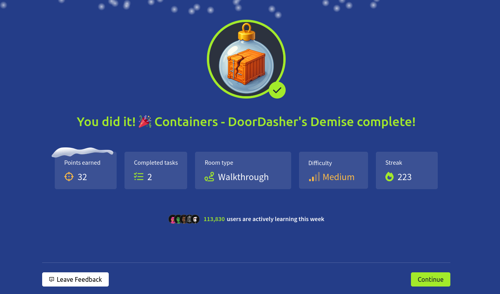

# Dia 14 - Containers - DoorDasher's Demise

  

### Objetivo

El objetivo del dia 14 es comprender los fundamentos de los contenedores y Docker desde una perspectiva de seguridad, analizando como una mala configuracion puede permitir la escapatoria de un contenedor y la escalada de privilegios, a traves del escenario propuesto, se busca que el usuario entienda la diferencia entre contenedores y maquinas virtuales, identifique riesgos asociados al acceso al runtime de Docker y aplique estos conocimientos para recuperar un servicio comprometido, demostrando la importancia de asegurar correctamente entornos basados en contenedores.

- Aprender como funcionan los contenedores y Docker, incluyendo imágenes, capas y el motor de contenedores.

- Explorar conceptos del runtime de Docker (sockets, API del daemon) y vectores comunes de escape de contenedores y escalada de privilegios.

- Aplicar estos conocimientos para investigar capas de imágenes, escapar de un contenedor, escalar privilegios y restaurar el servicio de DoorDasher.

### Navegando por el desafio

En esta seccion se introduce el concepto de contenedores y el problema que buscan resolver, las aplicaciones modernas suelen ser complejas debido a diferencias de configuracion entre entornos, conflictos de dependencias y dificultades para diagnosticar errores, la contenerizacion soluciona esto al empaquetar la aplicacion junto con todas sus dependencias en un entorno aislado, garantizando que se ejecute de la misma forma sin importar el sistema donde se despliegue.

Se explica la diferencia entre contenedores y maquinas virtuales, mientras que las maquinas virtuales incluyen un sistema operativo completo y se ejecutan sobre un hipervisor, los contenedores comparten el kernel del sistema anfitrion y solo aislan la aplicacion y sus librerias, esto los hace mucho mas ligeros, rapidos y eficientes en consumo de recursos.

Tambien se introduce el uso de contenedores en arquitecturas de microservicios, donde las aplicaciones se dividen en multiples componentes independientes, este enfoque permite escalar solo las partes necesarias de una aplicacion, y los contenedores se convierten en la solucion ideal por su facilidad de despliegue y escalado.

Finalmente, se presenta Docker como uno de los motores de contenedores mas utilizados, docker se encarga de construir, ejecutar y administrar contenedores mediante imagenes compuestas por capas, se menciona ademas el concepto de escape de contenedor, que ocurre cuando un proceso dentro de un contenedor logra acceder a recursos del sistema anfitrion o a otros contenedores, generalmente debido a configuraciones inseguras como el acceso al socket de Docker.

Luego de la parte teorica la habitacion le presenta un desafio guiado al usuario, en este reto, el usuario debe analizar un entorno con multiples contenedores, identificar configuraciones inseguras y comprender como un atacante podria abusar de ellas. El objetivo principal es reforzar el entendimiento de los riesgos asociados a una mala configuracion de contenedores

  

  

  

### Lecciones aprendidas

- Los contenedores facilitan el despliegue y la consistencia de las aplicaciones al aislarlas junto con sus dependencias, reduciendo problemas de configuracion entre entornos.

- Comprender la diferencia entre contenedores y maquinas virtuales es clave para elegir la tecnologia adecuada segun el caso de uso, especialmente en terminos de rendimiento y escalabilidad.

- Un mal diseño o configuracion de seguridad en contenedores puede romper el aislamiento esperado y permitir escapes de contenedor.

- El acceso a recursos criticos como el socket de Docker representa un riesgo elevado y debe ser estrictamente controlado.
