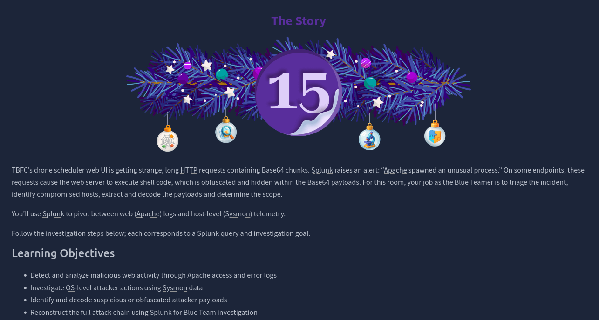
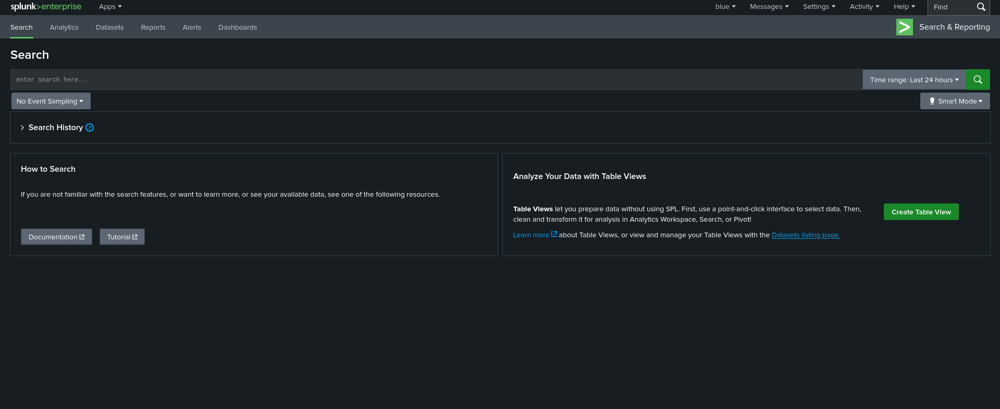

# Dia 15 - Web Attack Forensics - Drone Alone

  

### Objetivo

En este dia, la habitacion se centra por completo en un ejercicio practico de respuesta a incidentes usando Splunk, el usuario asume el rol de un analista Blue Team que debe investigar una alerta relacionada con actividad web sospechosa en un servidor Apache.

El objetivo general del desafio es analizar un posible ataque web, comprender como evoluciono y determinar su impacto, utilizando distintas fuentes de logs dentro de Splunk.

- Detectar y analizar actividad web maliciosa mediante los logs de acceso y error de Apache

- Investigar acciones del atacante a nivel del sistema operativo utilizando datos de Sysmon

- Identificar y decodificar payloads sospechosos u ofuscados del atacante

- Reconstruir la cadena completa del ataque usando Splunk desde una perspectiva Blue Team

### Navegando por el desafio

El usuario comienza accediendo al panel de Splunk y configurando correctamente el rango de tiempo para asegurarse de visualizar todos los eventos relevantes. A partir de ahi, la investigacion sigue un flujo logico que simula un proceso real de triage e investigacion de incidentes.

  

Primero, se analizan los logs de acceso web (Apache) para identificar peticiones HTTP anormales que puedan indicar intentos de ejecucion de comandos o abuso de funcionalidades del servidor web, el usuario debe observar patrones inusuales, como solicitudes excesivamente largas o contenido codificado, que suelen ser señales de ataques, luego, la investigacion se amplía a los logs de error de Apache, con el objetivo de confirmar si las solicitudes sospechosas lograron afectar al backend del servidor, esto permite evaluar si los intentos del atacante fueron bloqueados o si alcanzaron a ejecutarse parcialmente.

En una siguiente fase, el usuario pivota hacia telemetria del sistema operativo (Sysmon) para analizar la relacion entre procesos, aqui se busca determinar si el servidor web genero procesos inesperados, lo cual seria una señal clara de compromiso a nivel del sistema, posteriormente, el usuario revisa eventos asociados a comandos de reconocimiento, utilizados comunmente por atacantes tras obtener ejecucion de codigo, con el fin de entender el nivel de acceso alcanzado.

Finalmente, el desafio lleva al usuario a identificar payloads ofuscados, comunmente codificados en Base64, y a evaluar su posible impacto, el analisis de este paso permite comprender las intenciones reales del atacante y cerrar el ciclo completo del ataque, este dia refuerza el uso de Splunk como una herramienta clave para correlacionar eventos, reconstruir cadenas de ataque y evaluar el alcance de un incidente, todo desde una perspectiva defensiva y basada en logs reales.

  

### Lecciones aprendidas

- Los logs web son una fuente clave para detectar ataques tempranos, especialmente cuando aparecen solicitudes HTTP inusuales o con datos codificados.

- El analisis combinado de logs de aplicacion (Apache) y telemetria del sistema (Sysmon) permite confirmar si un ataque paso de la capa web al sistema operativo.

- El uso de Base64 y PowerShell ofuscado es una tecnica comun para evadir deteccion, por lo que es fundamental saber identificar y decodificar estos payloads.

- Las relaciones entre procesos (parent-child) ayudan a detectar compromisos claros, como cuando un servidor web ejecuta comandos del sistema.

- Splunk facilita el pivotaje entre distintas fuentes de datos, permitiendo reconstruir la cadena completa del ataque y entender su alcance real.