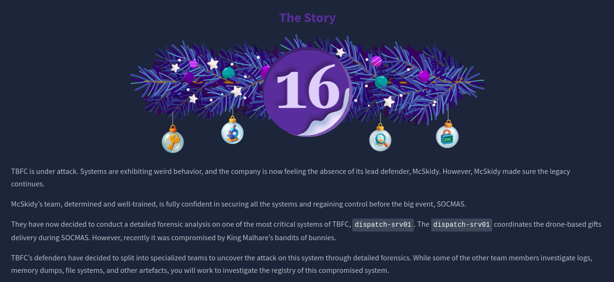
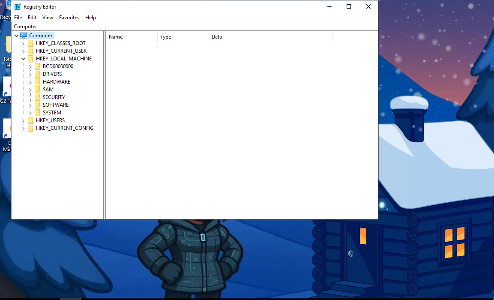
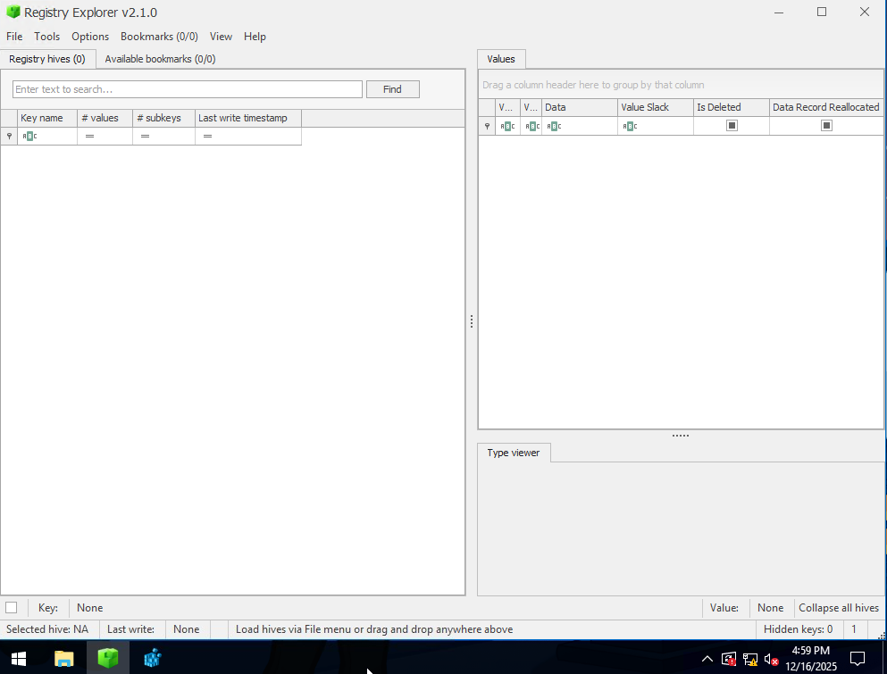
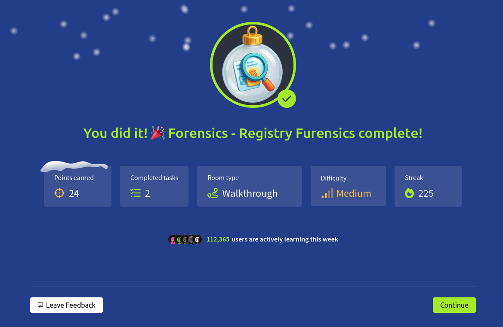

# Dia 16 - Forensics - Registry Furensics

  

### Objetivo

El dia de hoy el objetivo de esta habitacion es introducir al usuario en el analisis forense del Registro de Windows como parte de una investigacion de incidentes, se busca que el usuario comprenda que el Registro funciona como el “cerebro” del sistema operativo, almacenando configuraciones del sistema, actividad del usuario y datos historicos que pueden ayudar para identificar una intrusion.

Se aprende a reconocer que hives y claves del registro contienen informacion relevante desde el punto de vista forense y por que su analisis debe realizarse de manera controlada y offline, ademas, los objetivos de la habitacion son los siguientes:

- Entender que es el Registro de Windows y que contiene.

- Profundizar en los Hives del Registro y las Root Keys.

- Analizar los Hives del Registro mediante la herramienta integrada Registry Editor.

- Aprender forensica del Registro e investigar usando la herramienta Registry Explorer.

### Navegando por el desafio

La habitacion comienza explicando que el Registro de Windows es una base de datos centralizada que almacena la configuracion del sistema, servicios, dispositivos conectados, programas instalados y acciones realizadas por los usuarios, esta informacion se encuentra distribuida en varios archivos llamados Registry Hives como SYSTEM, SOFTWARE, SAM y NTUSER.DAT, los cuales se organizan dentro del sistema mediante root keys como HKEY_LOCAL_MACHINE y HKEY_CURRENT_USER.

  

Desde del punto de vista forense, el Registro es una fuente valiosa para reconstruir actividades pasadas, como ejecucion de programas, dispositivos USB conectados, configuraciones de inicio automatico y cambios realizados por un atacante, pero tambien se menciona que estos hives no deben analizarse directamente en el sistema comprometido, ya que esto podria alterar la evidencia por las acciones del forense.

Por esta razon, el desafio introduce el uso de Registry Explorer, una herramienta especializada que permite cargar y analizar hives de manera offline, a lo largo del ejercicio, el usuario aprende a cargar correctamente los hives junto con sus transaction logs, navegar por claves relevantes y apoyarse en rutas comunmente utilizadas en investigaciones forenses. El objetivo no es solo encontrar datos especificos, sino entender donde buscar, que tipo de informacion es relevante y como interpretar los artefactos del registro dentro del contexto de una intrusion.

  

Ahora el usuario con la ayuda de la informacion que se le dio tiene que responder las preguntas de la habitacion, usando Registry Explorer, tiene que indagar en los Registry Hives para encontrar informacion de una aplicacion que fue instalada antes del incidente que hubo en el caso de la habitacion, lo bueno es que ya la habitacion proporciona una tabla de paths que ayudara a responder estas preguntas, por el ejemplo, la primera pregunta es con respecto al nombre de la aplicacion que fue instalada el dia del incidente, segun la tabla esa informacion se encuentra en:

SOFTWARE/Microsoft/Windows/Uninstall

  

### Lecciones aprendias

- El Registro de Windows es una fuente clave de informacion forense, ya que almacena configuraciones del sistema, actividad del usuario y rastros de ejecucion de programas.

- Comprender la relacion entre Registry Hives y Root Keys facilita una navegacion mas rapida y efectiva durante una investigacion.

- El uso de herramientas forenses como Registry Explorer permite analizar hives de forma segura y offline, evitando la modificacion de evidencia.

- Muchos indicadores de compromiso, como persistencia, ejecucion de programas y actividad reciente del usuario, pueden identificarse directamente desde el Registro.

- La correcta interpretacion del Registro ayuda a reconstruir la linea de tiempo del ataque y a entender el impacto real sobre el sistema comprometido.