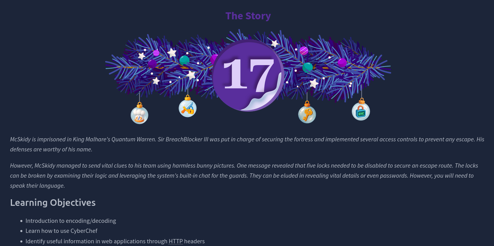
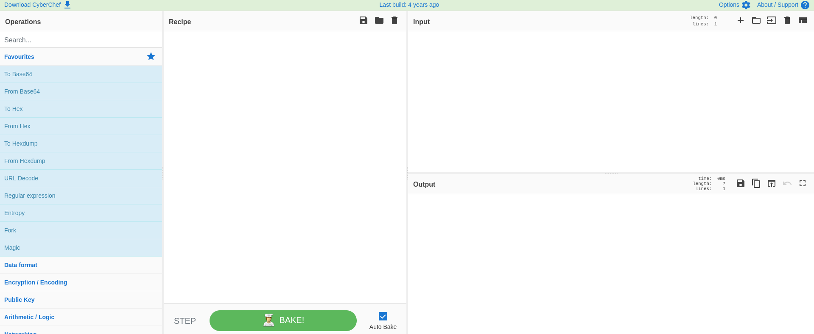
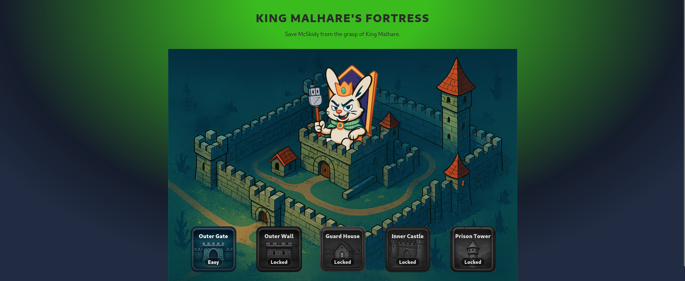
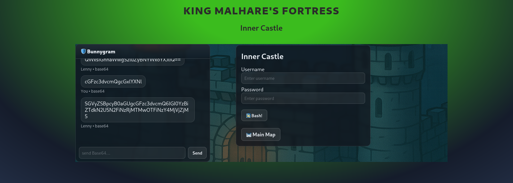
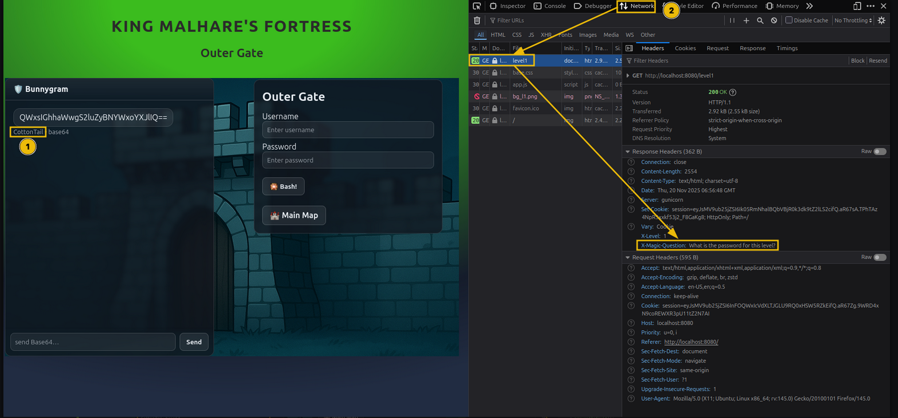
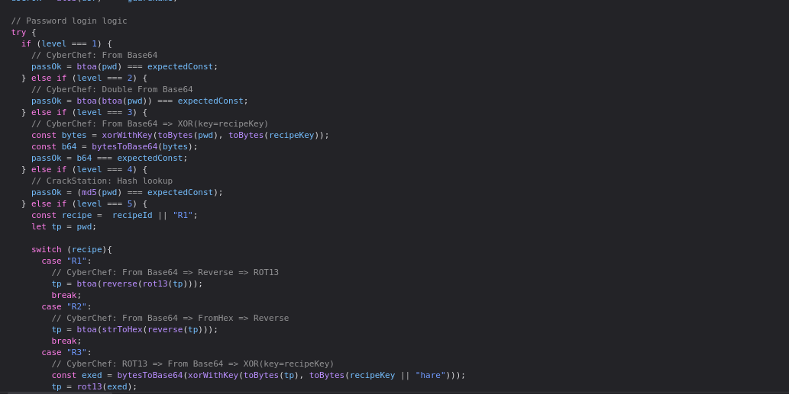
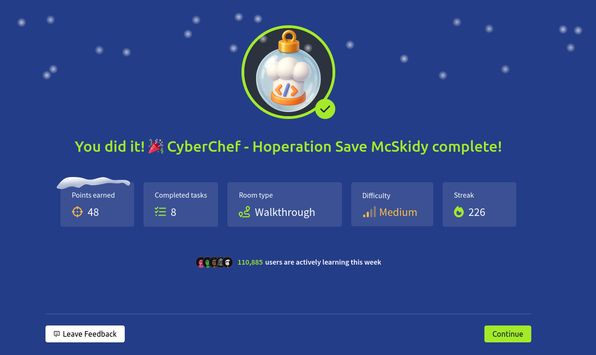

# Dia 17 - CyberChef - Hoperation Save McSkidy

  

### Objetivo

En este dia la habitacion se enfoca en la aplicacion Cyberchef, es un sitio web utilizar para encodificar y descodificar textos, esta aplicacion cuenta con una gran variedad de formatos de datos, hashing, encriptacion y demas, el objetivo de esta habitacion es que el usuario aprendar a utilizarla y ademas:

- Introduccion a encondificacion/descodificacion
- Aprender como utilizar Cyberchef
- Identificar informacion util en aplicaciones web con ayuda de HTTP Headers

### Navegando por el desafio

En este dia se introduce los conceptos de encoding y decoding, mostrando su diferencia frente a la encriptacion, el encoding se utiliza para garantizar compatibilidad y correcta transmision de datos entre sistemas, mientras que el decoding permite revertir ese proceso y recuperar la informacion original, tecnicas como Base64 son comunes en escenarios web y de seguridad, ya que permiten ocultar o transportar datos sin aportar confidencialidad real.

Para apoyo se utiliza CyberChef, una herramienta versatil conocida como la “navaja suiza” del analista, CyberChef permite aplicar y encadenar multiples operaciones de transformacion de datos, facilitando la codificacion, decodificacion y analisis de cadenas sospechosas de forma rapida y visual.

  

Adicionalmente, el desafio introduce el uso de las herramientas de desarrollo del navegador, las cuales permiten inspeccionar informacion que no siempre es visible en el contenido renderizado de una pagina web, a traves de estas herramientas, el usuario puede analizar codigo fuente, solicitudes, respuestas y datos ocultos, que luego pueden ser procesados y decodificados con CyberChef para revelar su verdadero contenido.

A partir de aqui, la habitacion le presenta al usuario el desafio para completarla, se le da un sitio web con distintos niveles que tiene que ir completando en orden, en cada nivel el usuario tiene que encontrar la manera de primero conseguir la password y luego decodificarla para poder pasar siguiente nivel, ademas, la habitacion ya le da una explicacion al usuario sobre lo que tiene que hacer en cada nivel.

  

El primer nivel siendo el mas facil debido a que lo unico que se tiene que hacer es pedirle la contraseña al chat mediante mensajes codificados en base64, en el primer nivel este se encuentra en el archivo 'level1' en el apartado Network dentro de las herramientas de desarollado del navegador mencionada antes, con la ontraseña codificada en base64 ya dada en el chat lo unico que hay que hacer es utilizar cyberchef para conseguir la contraseña en texto plano para pasar al nivel 2.

  

  

  

  

### Lecciones aprendidas

- Comprender la diferencia entre encoding y encryption, y reconocer que muchos mecanismos defensivos simples solo utilizan encoding, lo cual puede revertirse facilmente.

- Uso efectivo de CyberChef para construir recetas encadenadas (Base64, XOR, ROT, Reverse, Hex, etc.) y revertir transformaciones paso a paso.

- Importancia de inspeccionar aplicaciones web mas alla de lo visible, analizando headers, codigo JavaScript y logica de autenticacion desde las herramientas de desarrollo del navegador.

- Comprension practica de operaciones como XOR y su propiedad reversible cuando se reutiliza la misma clave.

- Reconocimiento del uso de hashes (MD5) y la aplicacion de recursos externos como bases de datos de hashes para recuperar contrasenas cuando no es posible una decodificacion directa.
