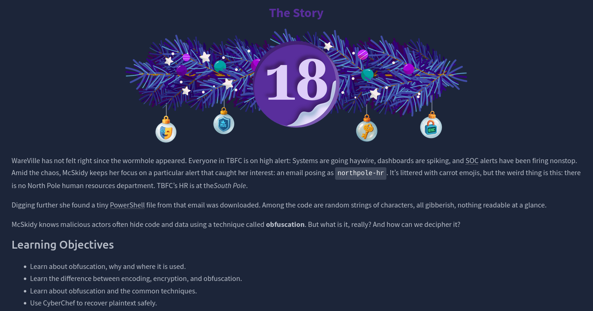
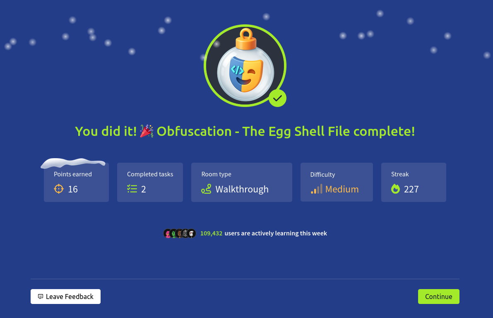

# Dia 18 - Obfuscation - The Egg Shell File

  

### Objetivo

Esta habitacion presenta el concepto de ofuscacion, una tecnica usada por actores maliciosos para esconder codigo y datos, el objetivo es hacer que la informacion sea dificil de leer y analizar, permitiendo evadir detecciones basicas y ralentizar las investigaciones de seguridad, a traves de este modulo, se aprende a distinguir entre ofuscacion, encoding y encriptacion, y a utilizar la herramienta CyberChef para revertir estas tecnicas.

- Aprender sobre ofuscacion, porque y donde es utilizado
- Aprender la diferencia entre encodificar, encriptacion y ofuscacion
- Aprender sobre ofuscacion y tecnicas comunes
- Usar Cyberchef para recuperar texto plano

### Navegando por el desafio

Primero la habitacion ofrece algo de teoria para que el usuario tenga un mejor entendimiento de lo que esta haciendo.

Es importante entender la diferencia entre tres conceptos similares, el encoding como Base64 transforma datos para asegurar su transmision entre sistemas, pero no ofrece seguridad, la encriptacion como AES protege la confidencialidad usando una clave criptografica, siendo su proceso reversible solo con dicha clave, la ofuscacion como ROT13 busca ocultar el significado del contenido para dificultar su analisis, pero sin proveer una verdadera proteccion criptografica, en seguridad, muchas defensas superficiales solo usan encoding u ofuscacion, que pueden revertirse facilmente.

Una tecnica basica es el cifrado por desplazamiento como ROT1 o ROT13, donde cada letra se mueve un numero fijo de posiciones en el alfabeto, otra tecnica comun es XOR, una operacion matematica que combina cada byte del texto con una clave, produciendo a menudo caracteres no imprimibles, la ofuscacion avanzada combina multiples capas de estas tecnicas, por ejemplo, aplicando compresion, XOR y finalmente codificacion en Base64 de forma consecutiva, para detectar la tecnica usada se buscan patrones, como ROT13 que altera palabras comunes, Base64 genera strings largos con caracteres alfanumericos y signos como + o /, y XOR suele producir una salida de la misma longitud que la entrada, con simbolos aparentemente aleatorios.

Una vez explicada esta teoria, la habitacion le presenta el desafio al usuario que tiene que completar con la ayuda de CyberChef:

  

Aqui el usuario tiene que seguir las intrucciones que estan como comentarios dentro del codigo, en el primer paso tiene que desofuscar la variable para poder conseguir la flag y en el segundo paso tiene que ofuscar la API que se le da utilizando XOR y la llave 0x37 para luego pasar eso a HEX, obviamente los resultados que consigue en CyberChef tiene que cambiarlos en el visual studio code para que cuando ejecute el codigo se le den las flags que necesita y asi complentando la maquina

  

### Lecciones aprendidas

- Comprender la distincion fundamental entre encoding, encriptacion y ofuscacion es el primer paso para un analisis efectivo, reconocer que muchas defensas superficiales o scripts maliciosos utilizan ofuscacion reversible, y no encriptacion fuerte, cambia el enfoque de la investigacion.

- La herramienta CyberChef es un recurso indispensable para el analista, permitiendo de manera rapida y visual probar y encadenar operaciones de decodificacion, ademas su funcion "Magic" sirve como un excelente punto de partida para identificar tecnicas comunes de forma automatica.

- La detecton de patrones visuales es una habilidad clave, reconocer strings que terminan en "==" (Base64), palabras que parecen desplazadas una letra (ROT1) o secuencias de simbolos incoherentes (XOR) agiliza enormemente el proceso de deofuscacion.

- Los atacantes suelen emplear ofuscacion por capas, ej: Base64 -> XOR -> Compresion, para aumentar la complejidad, desafiar estas capas requiere aplicar las operaciones en el orden inverso, demostrando la importancia de un enfoque paso a paso.

