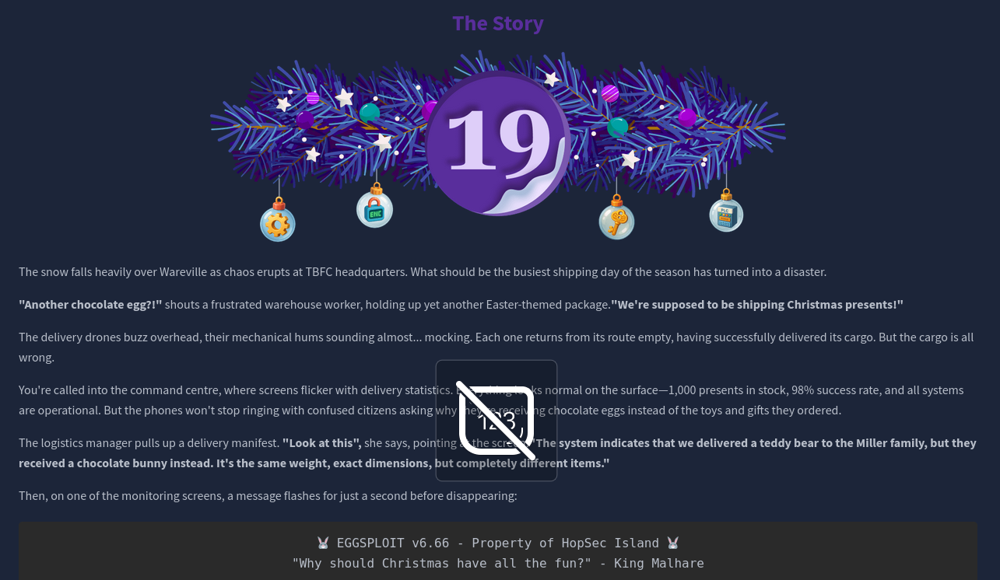
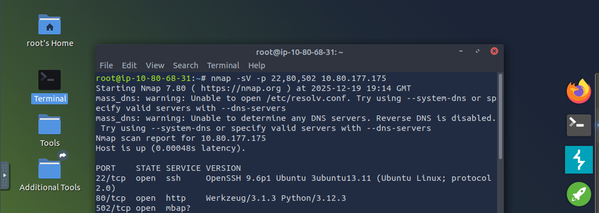
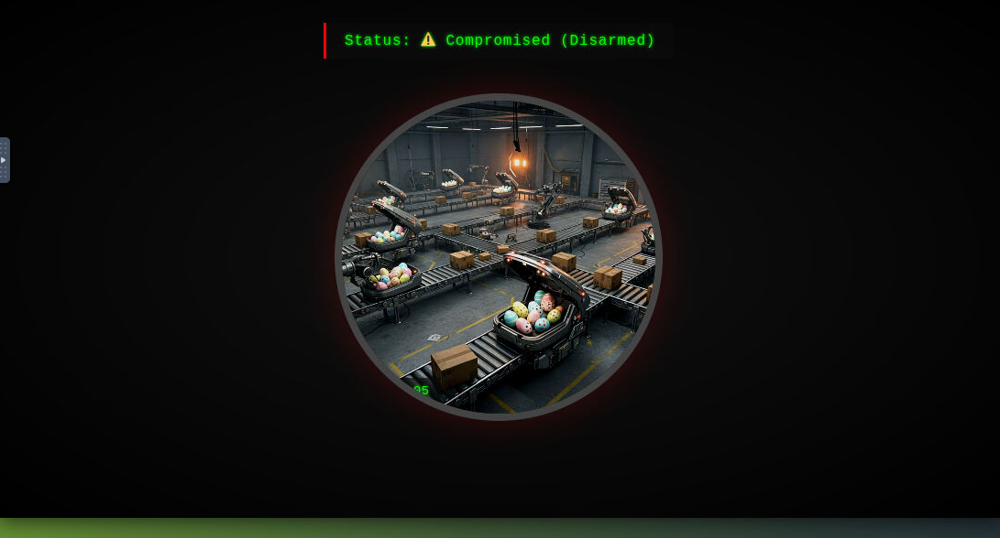
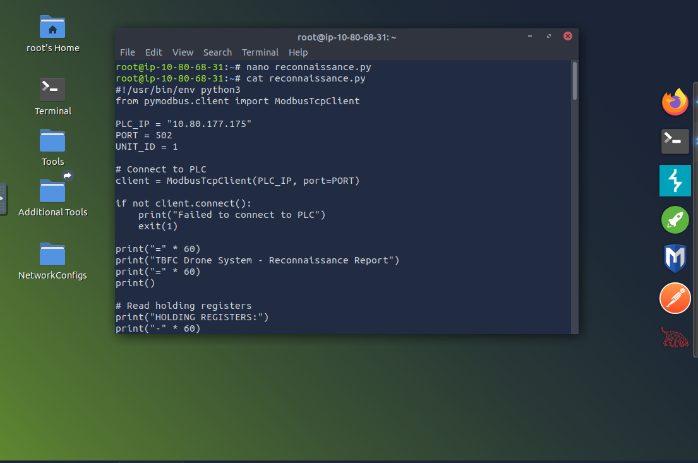
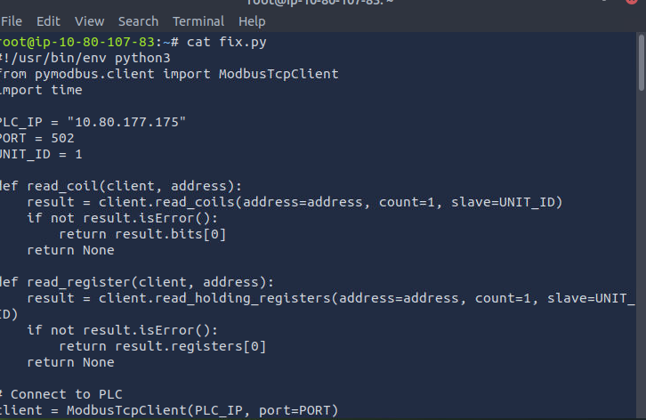

# Dia 19 - ICS/Modbus - Claus for Concern

  

### Objetivo

Durante este dia, el usuario se enfrenta a un entorno industrial comprometido, donde descubre informacion clave sobre el sistema de control a traves de una nota encontrada en la sala de control. Esta nota describe registros y banderas que afectan directamente al comportamiento del sistema de drones.

El objetivo es comprender el funcionamiento basico de los sistemas industriales que controlan el reparto de drones en TBFC, identificar una posible manipulacion del sistema y sentar las bases para su analisis y restauracion en los siguientes pasos del desafio.

### Navegando por el desafio

Durante este dia, el usuario se enfrenta a un entorno industrial comprometido, donde descubre informacion clave sobre el sistema de control a traves de una nota encontrada en la sala de control, esta nota describe registros y banderas que afectan directamente al comportamiento del sistema de drones.

El desafio no se centra aun en explotar o modificar el sistema, sino en entender que esta siendo manipulado, que componentes estan involucrados y por que el comportamiento observado no coincide con lo que muestran los paneles de control, se introduce al usuario en el contexto de un ataque a sistemas industriales, se introduce de forma general el funcionamiento de los sistemas SCADA, que actuan como centros de control para procesos industriales, permitiendo a los operadores supervisar y gestionar maquinaria, sensores y automatizacion.

Dentro de estos sistemas, los PLCs son los dispositivos encargados de ejecutar la logica de control, son equipos altamente fiables, diseñados para operar de forma continua y controlar directamente sensores y actuadores en tiempo real, la comunicacion entre estos dispositivos se realiza mediante Modbus, un protocolo industrial muy extendido que permite leer y escribir valores directamente en los PLCs, su principal problema es que carece de mecanismos de seguridad como autenticacion o cifrado, lo que permite que cualquier atacante con acceso a la red pueda manipular el sistema.

En el caso de la empresa del caso, el atacante ha utilizado Modbus TCP para modificar registros y coils que controlan el tipo de paquete, la zona de entrega, la verificacion de inventario, los mecanismos de proteccion y el registro de auditoria. Esta manipulacion explica por que el sistema parece funcionar correctamente mientras entrega productos incorrectos.

Luego de la parte teorica explicada, la habitacion le presenta el desafio al usuario

  

  

En este dia la parte practica es guiada paso a paso, se le ira explicando al usuario que esta ocurriendo, por que esta ocurriendo y como arregarlo, en las imagenes de arriba se puede ver un escaneo con nmap y la pagina que da la habitacion, esta pagina esta simulando camaras CCTV donde se muestra el estado del centro de logistica de la empresa del caso, en donde en vez de enviar regalos, estan enviando otros paquetes, el usuario con la ayuda de varios scripts hechos en python va a diagnosticar primero que parte del sistema SCADA y PLC fueron manipuladas para luego con otro script cambiar y arreglar dichas modificaciones

  

  

  

### Lecciones aprendidas

- Los sistemas SCADA son componentes criticos en entornos industriales, ya que permiten supervisar y controlar procesos fisicos a gran escala desde un unico punto central.

- Los PLCs son el nucleo de la automatizacion industrial y ejecutan la logica que decide como se comporta el sistema en funcion de los datos recibidos de sensores y configuraciones internas.

- El protocolo Modbus, aunque ampliamente utilizado, carece de mecanismos de seguridad como autenticacion y cifrado, lo que lo convierte en un objetivo facil para atacantes con acceso a la red.

- La manipulacion de registros y coils puede alterar completamente el comportamiento de un sistema industrial sin generar alertas visibles para los operadores.

- Desactivar verificaciones de inventario y registros de auditoria permite a un atacante ocultar sus acciones y hacer que el sistema funcione de forma aparentemente normal.

- Los sistemas industriales priorizan la disponibilidad y la fiabilidad sobre la seguridad, lo que aumenta el impacto de una mala configuracion o de accesos no protegidos.

- Comprender los fundamentos de ICS y OT es esencial para poder investigar, detectar y responder ante incidentes de ciberseguridad en entornos industriales.