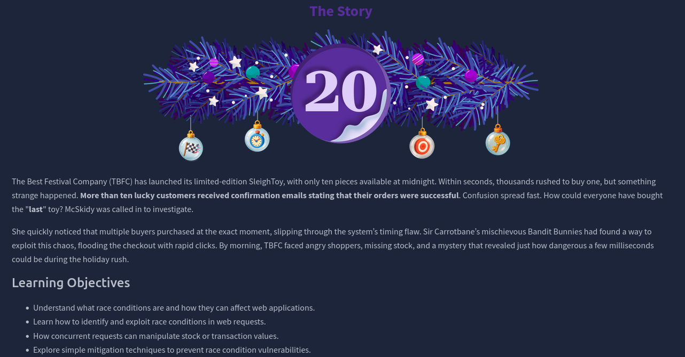
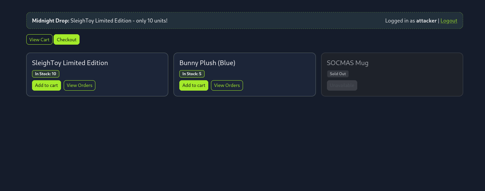
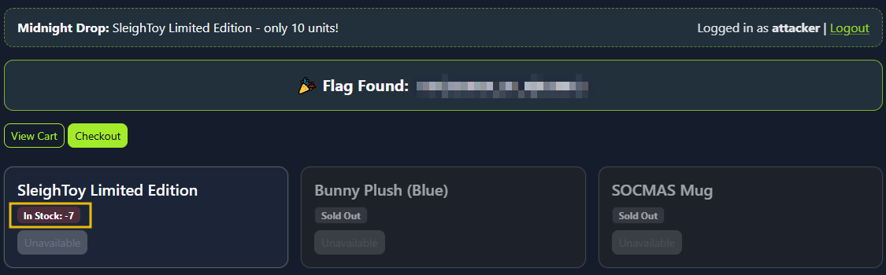
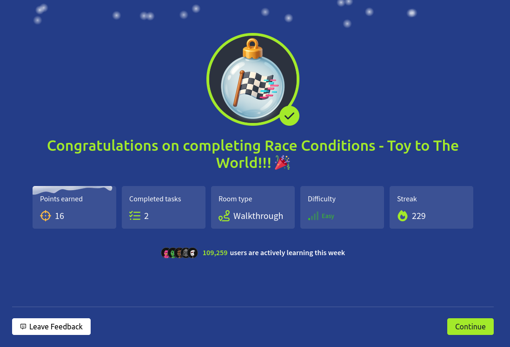

# Dia 20 - Race Conditions - Toy to The World

  

### Objetivo

El objetivo de este desafio es comprender que son las race conditions y como pueden afectar aplicaciones web, especialmente en escenarios donde multiples usuarios realizan acciones criticas al mismo tiempo. El usuario aprendera a identificar este tipo de vulnerabilidad, entender como puede ser explotada mediante solicitudes concurrentes y reconocer por que una mala gestion del tiempo y la concurrencia puede provocar errores graves como sobreventa de productos o estados inconsistentes en el sistema.

- Entender que son las race conditions y como pueden afectar a las aplicaciones web.

- Aprender a identificar y explotar race conditions en solicitudes web.

- Comprender como las solicitudes concurrentes pueden manipular valores de stock o transacciones.

- Explorar tecnicas simples de mitigacion para prevenir vulnerabilidades por race conditions.

### Navegando por el desafio

Una race condition ocurre cuando dos o mas acciones se ejecutan de forma simultanea y el resultado depende del orden en que finalizan. En aplicaciones web esto suele suceder cuando varias solicitudes acceden o modifican el mismo recurso compartido, como el inventario de un producto, sin los controles adecuados.

Se presentan principalmente tres tipos:

- TOCTOU (Time of Check to Time of Use): el sistema verifica una condicion y luego la usa, pero el estado cambia entre ambos momentos.

- Recursos compartidos: multiples procesos modifican los mismos datos al mismo tiempo, generando resultados impredecibles.

- Violacion de atomicidad: una operacion que deberia ejecutarse como un todo se divide en pasos, permitiendo interferencias entre ellos.

Estos problemas suelen aparecer cuando no existe sincronizacion, validaciones finales o transacciones atomicas.

En la parte practica, el usuario se enfrenta a una tienda web de TBFC que vende un producto con stock muy limitado. Aunque el sistema indica que solo hay unas pocas unidades disponibles, es posible realizar multiples compras al mismo tiempo explotando una race condition en el proceso de checkout.

  

El usuario debe configurar su entorno con Burp Suite, capturar una solicitud valida de compra y enviarla varias veces en paralelo. Debido a la falta de control en el servidor, todas las solicitudes se procesan como validas antes de que el stock se actualice, permitiendo comprar mas productos de los disponibles y dejando el inventario en valores negativos.

  

  

El desafio demuestra de forma practica como unos pocos milisegundos pueden marcar la diferencia y como una mala gestion de concurrencia puede ser explotada facilmente.

  

### Lecciones aprendidas

- Las race conditions pueden aparecer en aplicaciones web aparentemente simples cuando no se controla correctamente la concurrencia de solicitudes.

- El manejo incorrecto del tiempo entre la validacion y la ejecucion de una accion puede permitir resultados inesperados, como compras duplicadas o inventarios negativos.

- Las operaciones criticas, como pagos o gestion de stock, deben ejecutarse de forma atomica para evitar inconsistencias.

- Las solicitudes concurrentes pueden ser explotadas facilmente con herramientas como Burp Suite si no existen mecanismos de proteccion.

- La falta de controles finales antes de confirmar una transaccion es una debilidad comun en aplicaciones vulnerables.

- Implementar validaciones, bloqueos y controles de concurrencia es esencial para prevenir este tipo de ataques.

- Un pequeño fallo logico puede tener un gran impacto en sistemas reales, especialmente en escenarios de alta demanda.