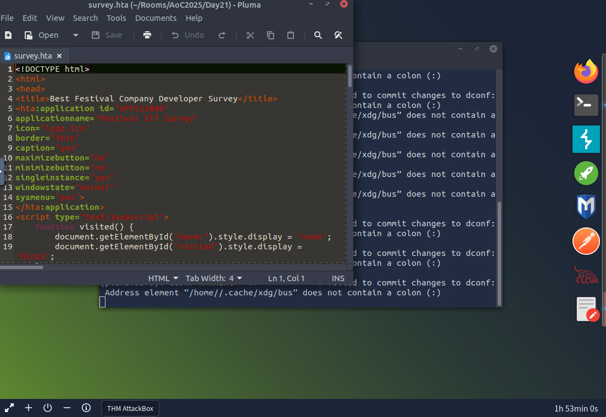
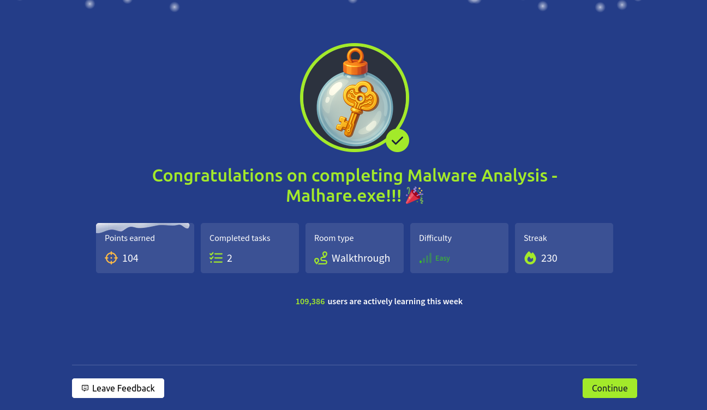

# Dia 21 - Malware Analysis - Malhare.exe

  

### Objetivo
El objetivo de este dia es comprender que son los archivos HTA y por que pueden representar un riesgo de seguridad en entornos Windows, el usuario aprendera a identificar como un archivo HTA puede ejecutar scripts de forma automatica, analizar su estructura interna y reconocer patrones comunes utilizados por atacantes para descargar, ejecutar o exfiltrar informacion desde un sistema comprometido.

- Comprender que es un archivo HTA y como funciona en Windows.

- Identificar el uso de VBScript y PowerShell dentro de un HTA.

- Reconocer tecnicas comunes de ofuscacion como Base64.

- Analizar llamadas a red y ejecucion de codigo oculto.

- Entender como un archivo aparentemente legitimo puede usarse como vector de ataque.

### Navegando por el desafio

El desafio introduce el analisis de un archivo HTA, un tipo de aplicacion basada en HTML y scripts que se ejecuta directamente en Windows mediante mshta.exe. Aunque estos archivos se usan de forma legitima para tareas administrativas o utilidades internas, tambien son frecuentemente abusados por atacantes debido a su capacidad para ejecutar codigo sin muchas restricciones.

El HTA combina tres elementos clave, metadatos que definen como se presenta la aplicacion, una interfaz HTML que ve el usuario y un bloque de scripts donde se ejecuta la logica, en escenarios maliciosos, esta logica suele incluir VBScript o JavaScript que invoca herramientas del sistema como PowerShell, descarga contenido externo y ejecuta codigo en memoria, para ocultar su intencion, los atacantes suelen usar tecnicas de ofuscacion como cadenas codificadas en Base64 y multiples funciones encadenadas.

En la parte practica, el usuario debe analizar un archivo HTA disfrazado como una encuesta de salarios, el proceso consiste en abrir el archivo de forma segura con un editor de texto, identificar la seccion de scripts, localizar funciones sospechosas y revisar objetos creados que interactuan con el sistema o la red, se deben identificar y decodificar cadenas Base64, seguir el flujo de las variables y entender que informacion se obtiene del sistema y como se ejecuta el codigo descargado.

El objetivo final es determinar que acciones realiza realmente el HTA, que datos recoge, si se comunica con servidores externos y como este archivo para comprometer los equipos del caso.

  

  

### Lecciones aprendidas

- Los archivos HTA pueden ejecutar codigo directamente en Windows y representan un riesgo si provienen de fuentes no confiables.

- Un archivo que aparenta ser una herramienta interna o una encuesta legitima puede ocultar logica maliciosa en su seccion de scripts.

- El uso de VBScript combinado con PowerShell es una tecnica comun para descargar y ejecutar codigo sin escribir archivos adicionales en disco.

- La ofuscacion mediante Base64 es una tecnica frecuente para ocultar URLs, comandos o payloads maliciosos.

- Analizar funciones, variables y el flujo de ejecucion permite entender que acciones realiza realmente un archivo sospechoso.

- Los objetos del sistema como WScript.Shell o InternetExplorer.Application son indicadores claros de posible actividad maliciosa.

- Abrir archivos potencialmente peligrosos en un editor de texto es una buena practica para evitar su ejecucion accidental.

- Comprender formatos usados legitimamente ayuda a detectar cuando estan siendo abusados por atacantes.