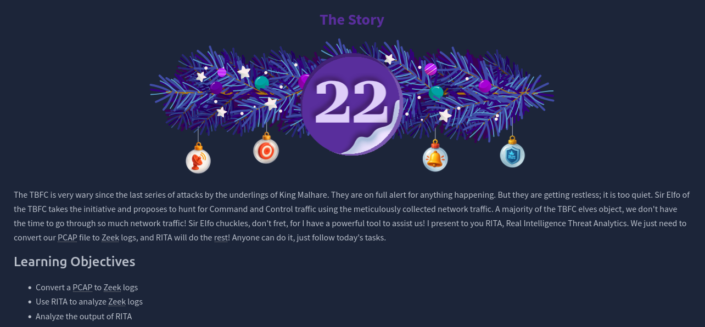
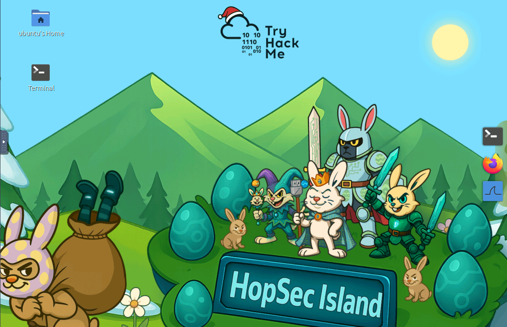
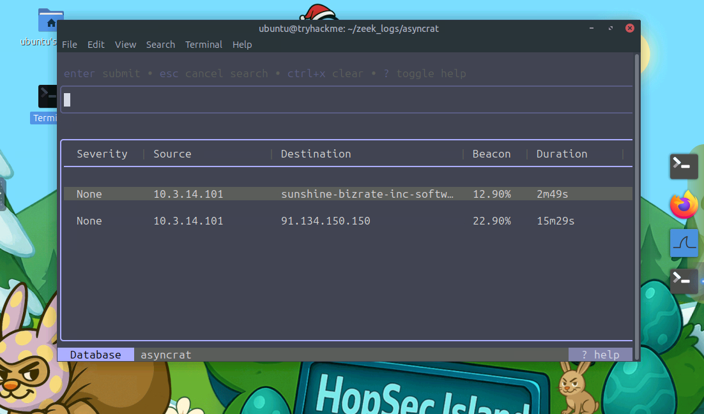
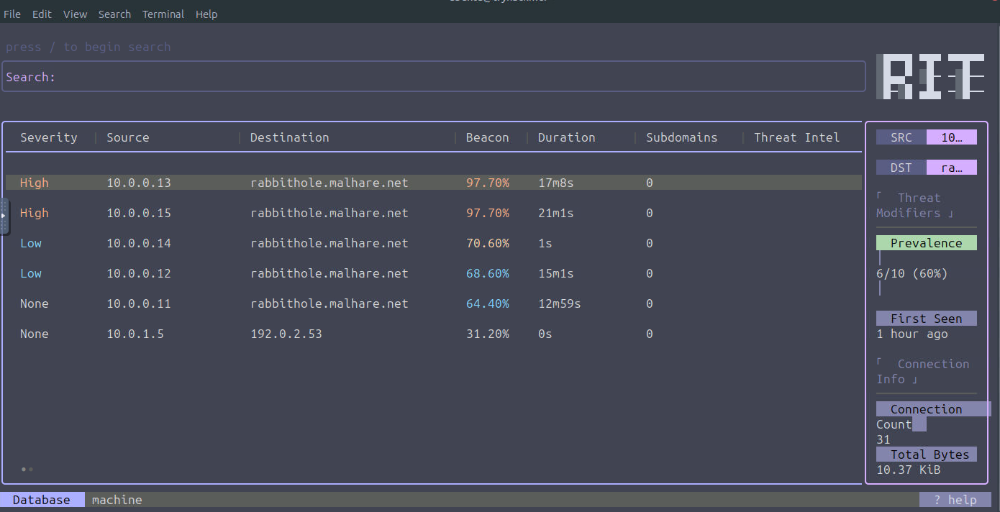
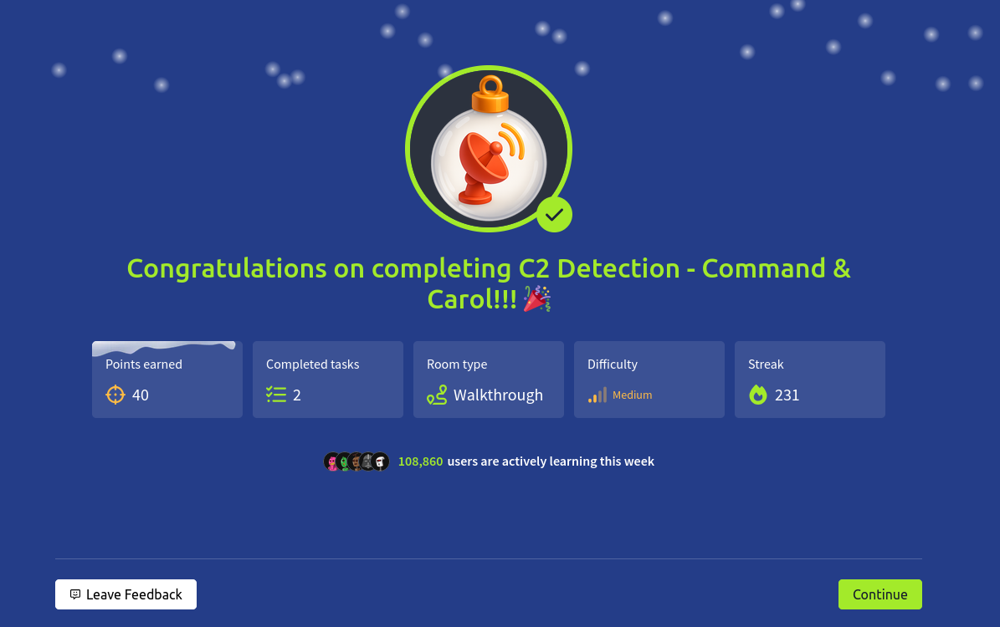

# Dia 22 - C2 Detection - Command & Carol

  

### Objetivo

En este dia el objetivo es aprender a detectar trafico de Command and Control (C2) mediante el analisis de trafico de red, el usuario conocerá como convertir capturas de red (PCAP) en logs de Zeek y como utilizar RITA (Real Intelligence Threat Analytics) para identificar comunicaciones sospechosas, posibles beaconing y otros indicadores de compromiso dentro de una red.

- Convertir PCAP a Zeek Logs
- Usar RITA para analizar logs de Zeek
- Analizar el output de RITA

### Navegando por el desafio

RITA es una herramienta de analisis que permite detectar posibles comunicaciones C2 a partir de logs generados por Zeek, un sistema de monitoreo de red que transforma el trafico capturado en informacion estructurada, RITA no trabaja directamente con PCAPs, por lo que primero es necesario convertirlos a logs de Zeek.

  

  

La herramienta analiza patrones como conexiones periodicas, uso excesivo de DNS, subdominios aleatorios, conexiones largas, puertos no estandar y coincidencias con feeds de threat intelligence, con esta informacion, RITA asigna niveles de severidad que ayudan al analista a priorizar posibles amenazas.

En el apartado practico el usuario tiene que usar un analisis de trafico de red real, debe convertir un archivo PCAP a logs de Zeek, importar esos logs en RITA y revisar los resultados generados, a partir de la informacion mostrada como severidad, duracion de conexiones, dominios, IPs y modificadores de amenaza, el usuario debe identificar posibles indicadores de compromiso y responder las preguntas del desafio basandose en el analisis que le muestra RITA.

  

  

