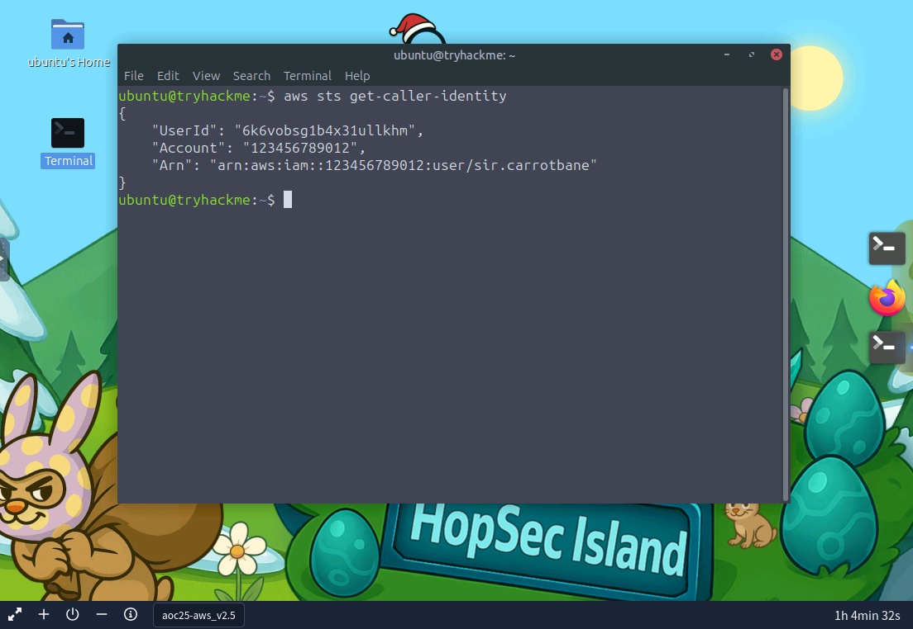
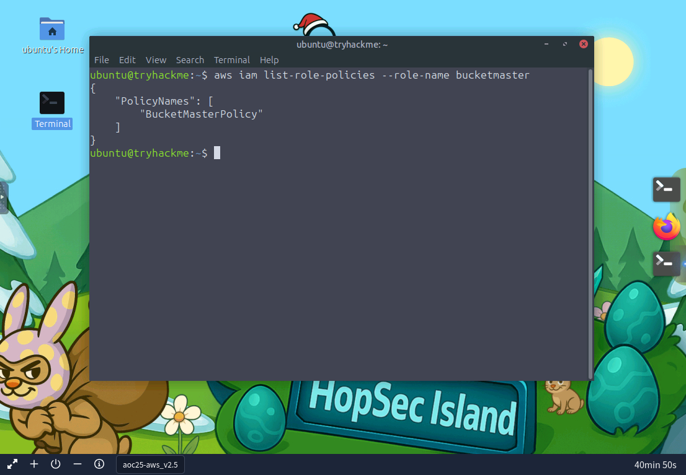
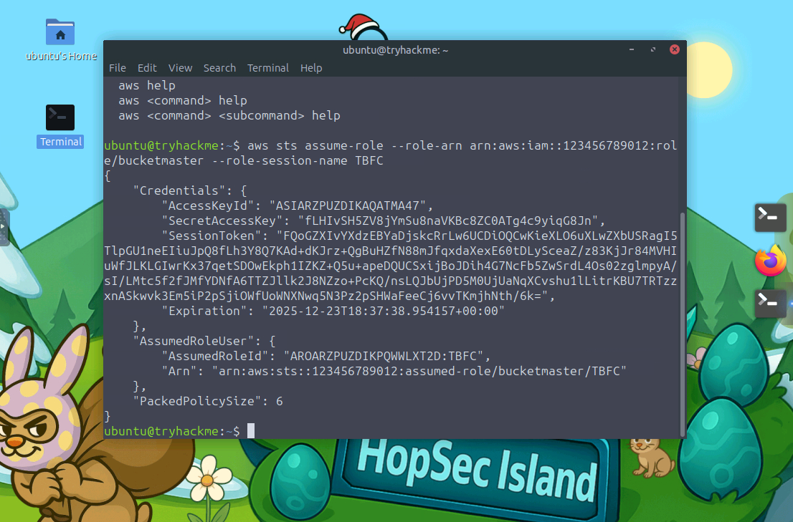
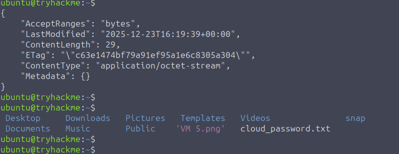
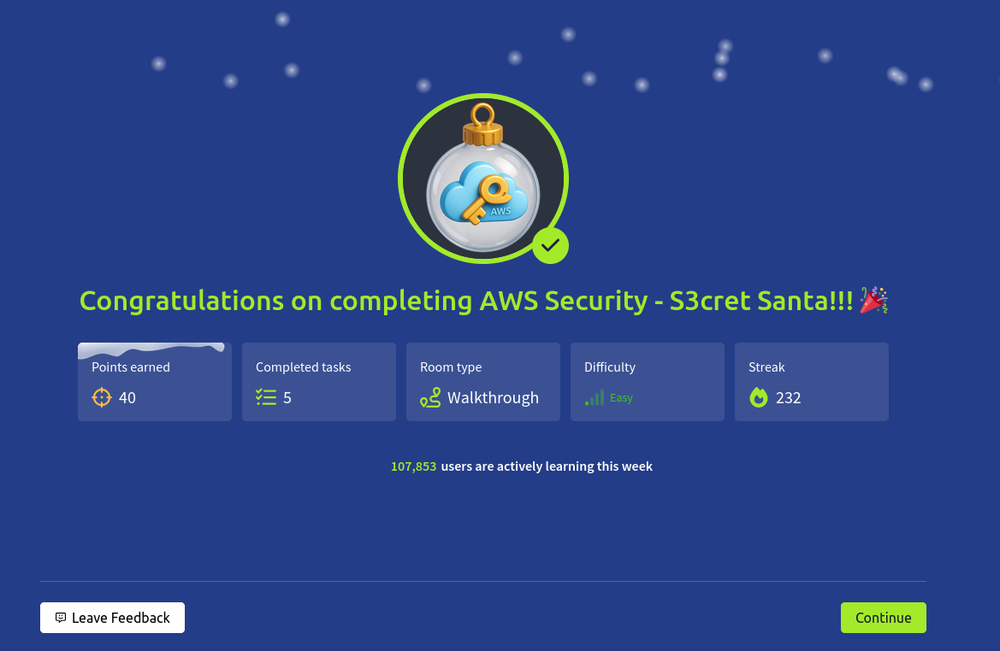

# Dia 23 - AWS Security - S3cret Santa

  

### Objetivo

El objetivo de esta habitacion es introducir al usuario en conceptos basicos de AWS (Amazon Web Services) desde un punto de vista de seguridad, entendiendo como funcionan algunos de sus servicios mas comunes y que riesgos existen cuando no se configuran correctamente, se busca que el usuario identifique fallos de exposicion en servicios de almacenamiento en la nube y comprenda por que AWS es un objetivo frecuente en escenarios reales.

- Aprender lo basico de las cuentas de AWS
- Enumerar privilegios dados a cuentas desde la perspectiva de un atacante
- Familiarizarse con la CLI de AWS

### Navegando por el desafio

La parte teorica explica de forma general que es AWS, como se estructuran sus servicios y por que elementos como S3 son ampliamente utilizados para almacenar informacion, se muestra la importancia en los controles de acceso, politicas de permisos y configuraciones publicas o privadas, mostrando como una mala gestion puede llevar a la exposicion de datos sensibles sin necesidad de explotar vulnerabilidades complejas.

En la parte practica, el usuario trabaja sobre un escenario relacionado con un recurso de AWS, donde debe analizar la informacion disponible y entender como se esta accediendo al servicio, siguiendo las instrucciones de la habitacion, el reto consiste en interactuar con el entorno, revisar el contenido accesible y razonar sobre la configuracion del servicio para avanzar paso a paso, el enfoque esta en la observacion, el analisis logico y el entendimiento del funcionamiento de AWS para finalmente obtener la informacion requerida, sin depender de ataques ruidosos o tecnicas avanzadas.

  

  

  

  

  

### Lecciones aprendidas

- Los servicios en la nube no son inseguros por defecto, pero una configuracion incorrecta de permisos puede exponer informacion critica.

- Entender como funcionan los servicios basicos de AWS facilita la identificacion de riesgos sin necesidad de explotar vulnerabilidades.

- La enumeracion y el analisis cuidadoso del entorno suelen ser suficientes para descubrir accesos indebidos.

- Muchas fugas de informacion en la nube ocurren por errores humanos y no por fallos tecnicos avanzados.