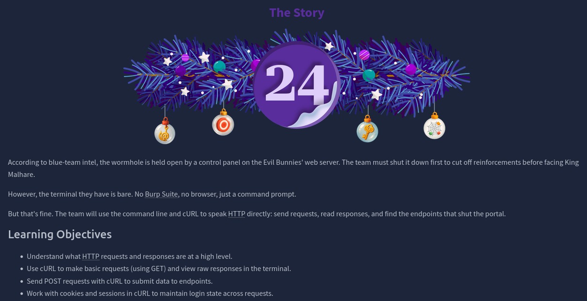
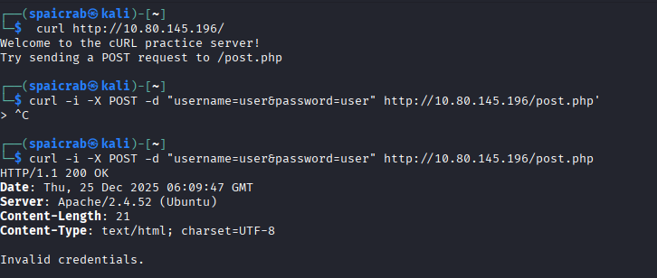
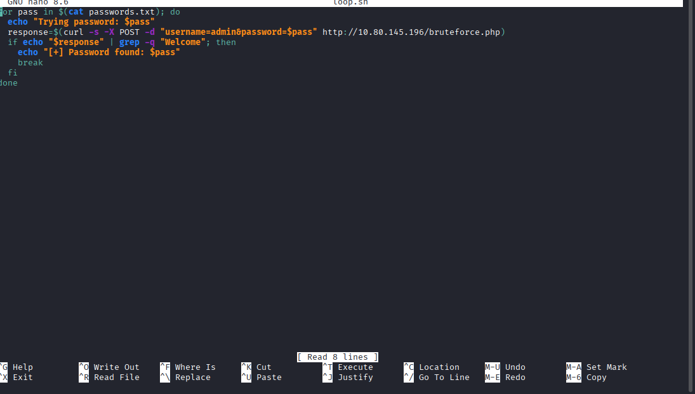
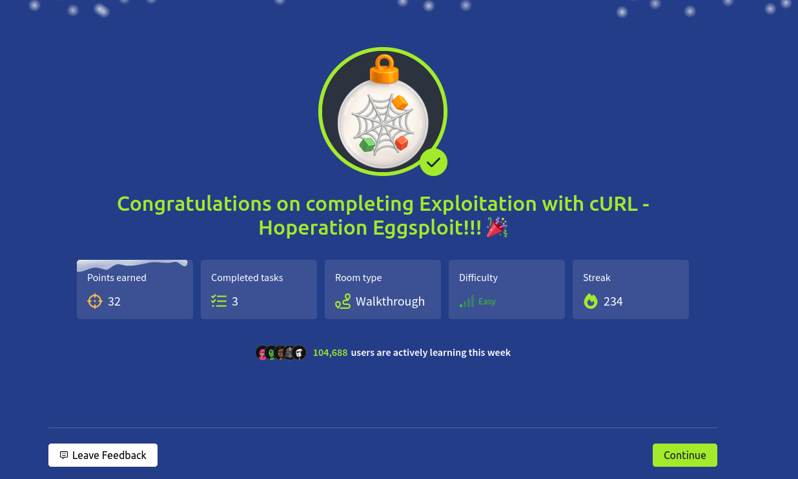

# Dia 24 - Exploitation with cURL - Hoperation Eggsploit

  

### Objetivo

El objetivo de esta habitacion es comprender como funcionan las peticiones HTTP a bajo nivel y como pueden realizarse sin necesidad de un navegador, se introduce el uso de cURL como herramienta para interactuar directamente con servidores web desde la linea de comandos, permitiendo enviar solicitudes, analizar respuestas y manipular sesiones

- Entender que son pedidos HTTP y respuestas en alto nivel
- Usar cURL para hacer pedidos basicos usando GET y ver respuestas crudas en la terminal
- Enviar pedidos POST con cURL para subir datos a endpoints
- Trabajar con cookies y sessiones en cURL para mantener un estado de login en los pedidos

### Navegando por el desafio

El usuario se enfrenta a un entorno limitado donde solo tiene acceso a una terminal, sin navegador ni herramientas como Burp Suite, el desafio consiste en comunicarse con un servidor web utilizando cURL para descubrir y utilizar distintos endpoints.

Durante la habitacion, el usuario debe enviar peticiones GET para observar respuestas crudas del servidor, simular formularios de inicio de sesion mediante peticiones POST y aprender a gestionar cookies para mantener una sesion activa entre solicitudes, tambien se introduce la automatizacion de peticiones repetitivas usando scripts bash, lo que permite probar multiples credenciales de forma controlada.

  

  

A lo largo del desafio, el usuario aprende a interpretar respuestas del servidor, identificar comportamientos distintos segun los datos enviados y adaptar las solicitudes mediante cabeceras personalizadas, como el User-Agent, para superar restricciones basicas, todo esto lo tiene que realizar con la ayuda de la informacion que ya se le fue dada en la habitacion, de esta manera concluyendo no solo con el desafio sino que tambien con el evento Advent Of Cyber

  

### Lecciones aprendidas

- HTTP es la base de la comunicacion entre clientes y servidores, y puede usarse directamente sin necesidad de un navegador.

- cURL permite enviar y analizar peticiones HTTP de forma manual, ofreciendo mayor control y visibilidad sobre las solicitudes y respuestas.

- Las peticiones GET y POST cumplen funciones distintas y su uso correcto depende del tipo de accion que se quiera realizar.

- Las cookies son fundamentales para mantener sesiones activas y deben gestionarse manualmente cuando se trabaja desde la linea de comandos.

- Automatizar peticiones con scripts ayuda a comprender como funcionan ataques de fuerza bruta y pruebas de autenticacion.

- Las cabeceras HTTP, como el User-Agent, pueden influir en el comportamiento del servidor y ser un punto debil si no se validan correctamente.

- Comprender estos conceptos permite entender mejor como operan herramientas de seguridad mas avanzadas y que ocurre internamente durante un ataque web.