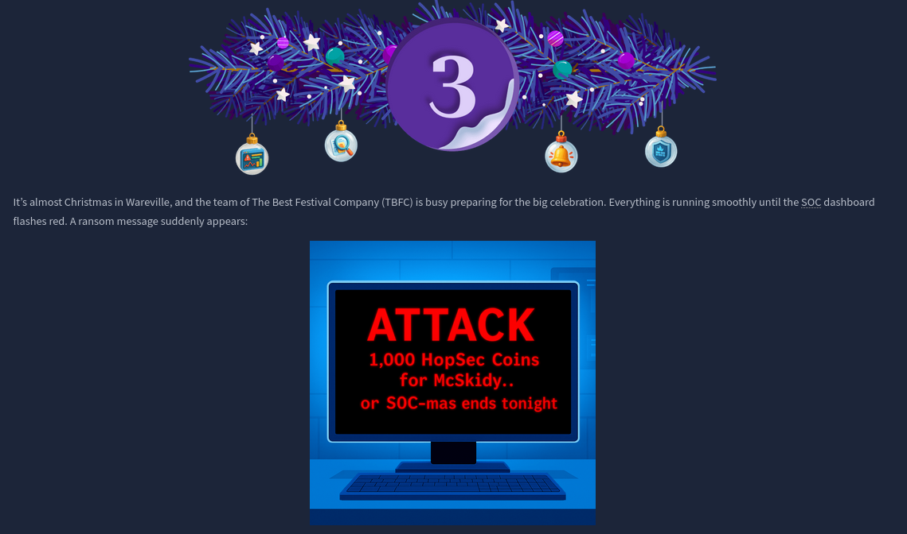
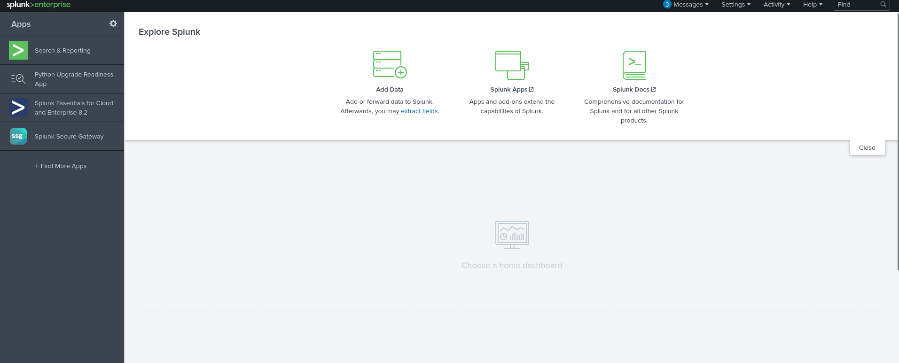

### Dia 3 - Splunk Basics - Did you SIEM?

  

### Objetivo

En este día, el enfoque cambia hacia la defensa, la habitación introduce a los usuarios al uso de Splunk, una solución SIEM ampliamente utilizada en entornos reales para la ingestión, análisis y correlación de eventos de seguridad, el objetivo es comprender cómo un analista de seguridad puede investigar incidentes utilizando logs de tráfico web y firewall, con la finalidad de reconstruir cómo ocurrió un ataque y qué impacto pudo haber tenido.

### Navegando por el desafío

Durante esta habitación, se guía al usuario para:

- Cargar e interpretar logs personalizados dentro de Splunk.
- Crear field extractions (extracciones de campos) para estructurar información cruda.
- Utilizar SPL, el lenguaje de búsqueda de Splunk, para filtrar, ordenar y analizar eventos de forma eficiente.
- Realizar una investigación completa, revisando pistas en los logs que ayuden a entender la ruta del ataque.

La historia plantea un escenario donde los sistemas de TBFC han sido comprometidos y se debe averiguar cómo se infiltró el ransomware, usando Splunk como herramienta principal, el usuario simula la labor de un analista SOC al buscar patrones en los eventos, revisar solicitudes sospechosas y correlacionar logs entre diferentes fuentes.

  

A diferencia de otros retos más técnicos o ofensivos, esta habitación enfatiza la importancia del análisis estructurado, observar los logs, detectar comportamientos anómalos, identificar IOCs (Indicators of Compromise) y entender cómo encajan en la narrativa del ataque, aquí la herramienta es solo una parte; el pensamiento analítico es lo esencial.

  

  

Splunk facilita este proceso gracias a su capacidad para transformar grandes volúmenes de datos en información útil, con SPL, es posible enfocarse únicamente en los eventos relevantes, crear consultas para detectar actividad sospechosa y visualizar tendencias que ayuden a reconstruir el incidente.

Al finalizar la habitación, el usuario habrá logrado reconstruir todo el flujo del ataque utilizando Splunk, desde la primera interacción hasta la actividad siguiente a la explotación, durante el análisis se identificaron puntos clave como:

- IP del atacante, determinada gracias al volumen y patrón de tráfico malicioso en los logs web.

- Herramientas y técnicas utilizadas, se observaron indicios claros de reconocimiento mediante cURL/Wget, intentos de acceso a archivos sensibles como /.env, pruebas de path traversal y la utilización de SQLmap para explotación.

- Vector de intrusión, la progresión de eventos en los logs web permitió ver el camino exacto que tomó el atacante antes de comprometer el servidor.

- Ejecución del payload, se descubrio que el atacante consiguió ejecutar comandos en el servidor, lo que llevo a la carga y ejecución de un binario malicioso.

- Actividad post-explotación, los logs del firewall confirmaron la comunicación C2 saliente desde el servidor comprometido hacia la IP del atacante, confirmando que el compromiso fue exitoso y se estableció control remoto.

  

### Lecciones aprendidas

- Cómo cargar y trabajar con logs personalizados en Splunk.

- La utilidad de las field extractions para facilitar el análisis.

- Uso básico y práctico de SPL para realizar búsquedas y filtrados.

- Cómo un analista SOC puede utilizar Splunk para investigar un incidente real mediante la correlación de eventos.

- La importancia de interpretar correctamente los logs para entender el alcance de un ataque.