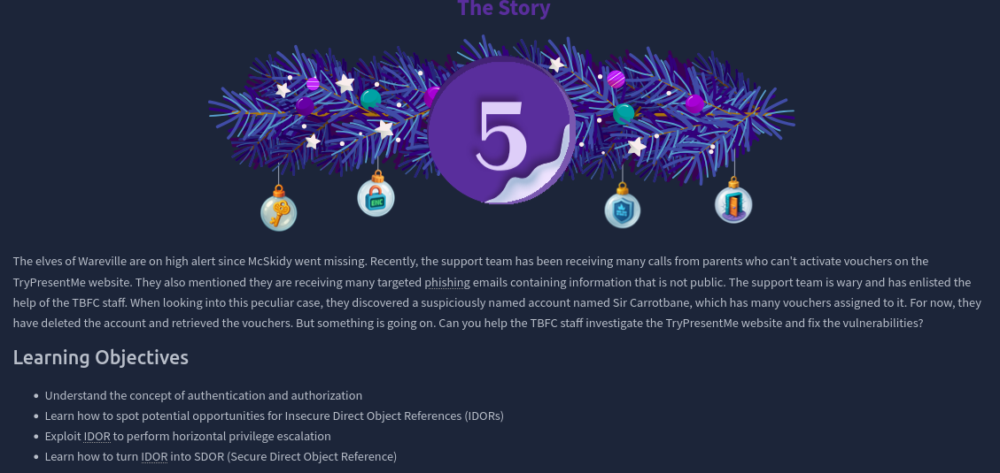
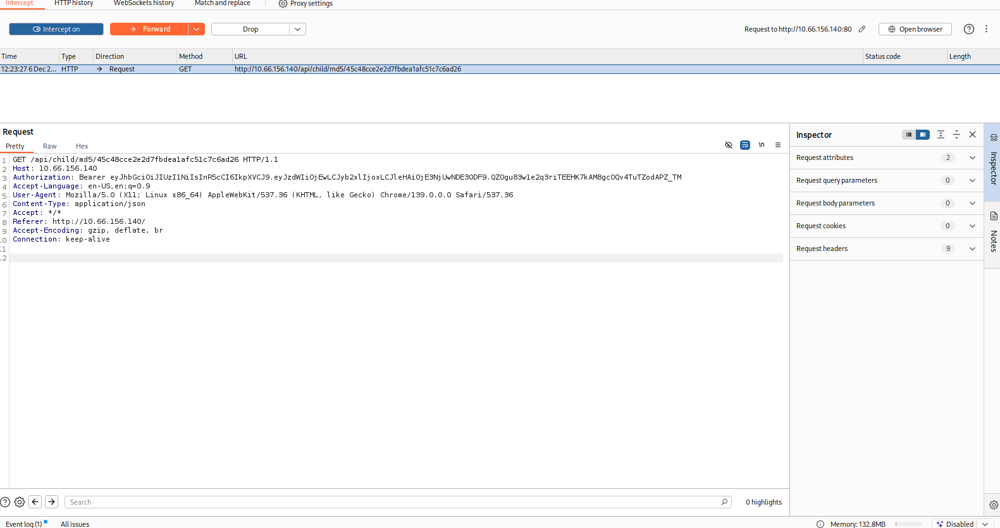

# Dia 5 - IDOR - Santa’s Little IDOR

  

### Objetivo

Este dia la habitacion se enfoca en la vulnerabilidad "Insecure Direct Object Reference" o IDOR, esta vulnerabilidad es un tipo de control de acceso, que ocurre cuando alguien utiliza el input de usuario de una aplicacion para acceder a objetos directamente, por ejemplo:

"/user/1"

En este caso alguien alguien podria simplemente manipular el numero en la URL para cambiar el ID el cual seria el 1, podria acceder a a la informacion privada de un usuario

- El concepto de IDOR
- Aprender a como encontrar esta vulnerabilidad 
- A como explotarla para realizar escalacion de privilegios horizontal
- Aprender a como convertir un IDOR en un SDOR (Secure Direct Object Reference)

### Navegando por el desafio

La habitacion inicia explicando que es una vulnerabilidad IDOR, un fallo de control de acceso que ocurre cuando una aplicacion permite que un usuario acceda directamente a un recurso manipulando un identificador, por ejemplo cambiando un numero en una URL como packageID=1001 por packageID=1002, si el servidor no valida que el usuario tiene permiso sobre ese recurso, se produce una fuga de informacion o acceso no autorizado.

El ejemplo muestra como aplicaciones con IDs secuenciales son vulnerables cuando no se comprueba la identidad del usuario antes de devolver datos, incluso peor, si no se requiere autenticacion, no existe ninguna manera de asociar esas solicitudes a un usuario legitimo, dejando la informacion completamente expuesta.

Para comprender mejor el origen del problema, el desafio repasa dos conceptos clave:

- Autenticacion: verificar quien eres mediante credenciales o tokens de sesion.

- Autorizacion: verificar que permisos tienes sobre un recurso.

Cada solicitud al servidor requiere ambas, sin autenticacion, la autorizacion ni siquiera puede evaluarse, muchos IDOR existen porque los desarrolladores confian unicamente en el parametro enviado por el usuario sin verificar si realmente pertenece a su cuenta.

Luego se explican dos tipos de escalacion de privilegios:

- Vertical: obtener capacidades de un rol superior, por ejemplo, funciones de administrador.

- Horizontal: acceder a datos de otro usuario del mismo nivel, que es donde encajan casi todos los casos de IDOR.

La idea clave es que una aplicacion puede permitirte usar una funcionalidad legitima como rastrear un paquete, pero debe comprobar que solo obtengas los datos que realmente te pertenecen, cuando estas validaciones no existen, la referencia directa al objeto se convierte en un vector de ataque.

### Nota de uno de los autores de la habitacion

Uno de los co-autores del desafio menciona que no es fan del termino IDOR, porque el nombre no describe realmente el problema, la parte “Direct Object Reference” solo indica que la aplicación usa un identificador para acceder a un recurso, lo cual es normal y no es el origen de la vulnerabilidad.

El problema real ocurre cuando la aplicacion no verifica si el usuario tiene permiso para acceder a ese recurso, es decir, cuando faltan controles de autorizacion, por eso, algunos intentan “ocultar” los IDs, por ejemplo, reemplazando /user/1 por un hash como /user/ea21f09b2, pero esto no soluciona nada si el servidor sigue sin validar permisos.

Por este motivo, el autor prefiere el termino Authorization Bypass, ya que describe exactamente lo que está ocurriendo, un usuario accede a información o acciones sin estar autorizado, independientemente del formato del ID, la vulnerabilidad persiste si la aplicación no realiza comprobaciones de acceso adecuadas.

Luego de esta parte teorica, la habitacion comienza con la parte practica, al usuario se la va a dar creedenciales y una IP que lo lleva a una pagina con respecto a la historia del evento, en donde al loguearse se le muestra un dashboard con la informacion de la cuenta con la que se logueo, cupones y otras funcionalidades relacionadas al caso de la historia del evento.

  

  

  

La habitacion ira guiando al usuario paso a paso sobre lo que tiene que hacer para responder las preguntas y completar la habitacion, pero ademas tambien son para:

- Como utilizar las herramientas de desarollador en el navegador web para cambiar valores
- Identificar el IDOR
- Como explotar la vulnerabilidad de IDOR para ver informacion de otras cuentas
- Explicarle al usuario sobre como la vulnerabilidad IDOR no es simplemente un numero sequencial como 10 o 11, sino que tambien pueden estar escondidas y ser un valor hash como MD5 o Base64

Al final la habitacion le explica al usuario tambien sobre como arreglar esta vulnerabilidad, debido a que el problema en si no es el identificador y no es suficiente con simplemente esconder o cambiar el numero del ID, el sistema tambien tiene que confirmar que el usuario logueado tiene que tener los permisos para ver o cambiar dicha informacion.

No hay que depender de trucos como usar Base64 o algun hash, ya que estos aun pueden ser decodificados o adivinados, los permisos tienen que mantenerse en el servidor, asegurandose de que los pedidos que llegan tengan que ser checkeados sobre si el usuario en cuestion es dueño o tiene permisos para ver el recurso solicitado.

  

### Nota

La habitacion cuenta con 2 tareas opcionales en donde se el usuario que tiene que encontrar valores especificos en IDS y en vouchers/cupones, aunque no son necesarias para completar la habitacion vale la pena hacerlas para tener un mejor manejo en la herramienta burpsuite

  

### Lecciones aprendidas

- IDOR no es un fallo del identificador, sino un fallo de autorizacion, cambiar numeros en la URL o manipular parametros no deberia permitir acceder a datos de otros usuarios si el servidor valida correctamente los permisos.

- Ocultar o codificar IDs no soluciona nada, usar Base64, hashes o IDs largos solo “maquilla” el problema, si el servidor no comprueba permisos, la vulnerabilidad sigue siendo explotable.

- Autenticacion y autorizacion son procesos distintos, la autenticacion identifica al usuario, la autorizacion define que puede hacer, sin autenticacion, no puede existir una autorizacion correcta.

- IDOR casi siempre implica escalacion horizontal, el usuario no esta intentando volverse administrador, esta intentando acceder a información de otro usuario del mismo nivel.

- El navegador es una herramienta poderosa para descubrir IDORs, manipular parametros, revisar peticiones en las DevTools o interceptar tragfico con BurpSuite permite detectar cómo la aplicación maneja sus referencias internas.

- Un buen diseño de seguridad siempre valida en el servidor, nunca se debe confiar en los datos enviados por el cliente, todo acceso debe verificarse contra la base de datos y el contexto del usuario autenticado.

- Las soluciones reales requieren logica de control de acceso, no trucos superficiales, el servidor debe asegurarse de que cada recurso solicitado pertenece o esta permitido para el usuario asociado a la sesion activa.