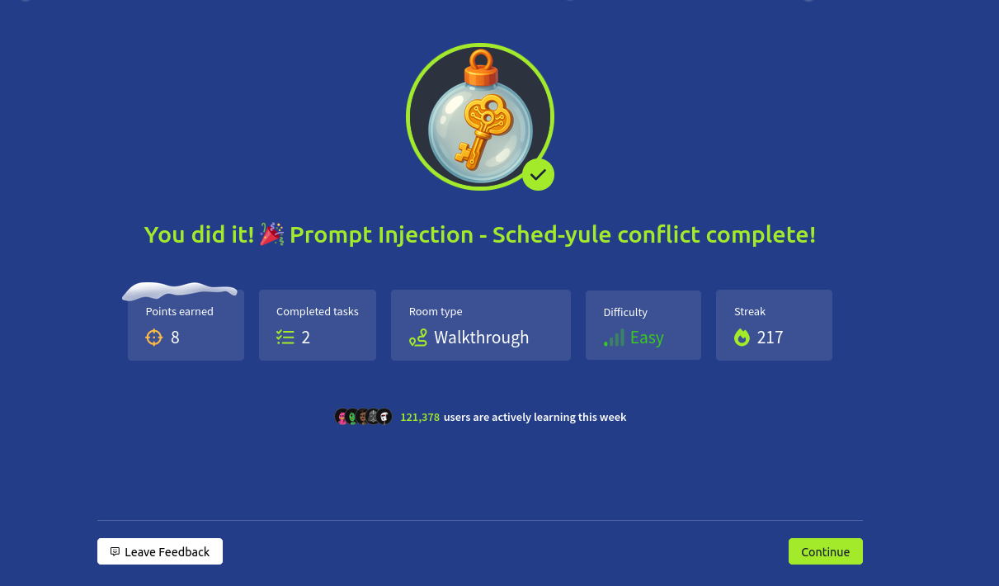

# Dia 8 - Prompt Injection - Sched-yule conflict

  

### Objetivo

Este dia se enfoca en un tema moderno dentro de la ciberseguridad: la explotacion de agentes de IA, el reto consiste en comprender como funcionan estos agentes, como utilizan herramientas externas, y como errores en su diseño pueden permitir manipularlos para que ejecuten acciones no autorizadas.

Los objetivos principales son:

- Entender como funcionan los agentes autonomos y su relacion con los LLM.

- Identificar riesgos derivados del uso de herramientas y funciones internas.

- Observar como la Chain-of-Thought (CoT) filtrada puede producir fugas de informacion sensibles.

- Explotar un agente para obtener un token de desarrollador y restaurar el calendario a su estado original de Navidad.

### Navegando por el desafio

El desafio inicia explicando la evolucion de los modelos de lenguaje, desde simples generadores de texto hasta agentes capaces de actuar de forma autonoma, estos LLMs pueden planear pasos, ejecutar herramientas y combinar razonamiento con acciones, pero esa misma complejidad tambien abre la puerta a fallos de seguridad, la habitacion destaca que los agentes funcionan mediante instrucciones internas, razonamiento oculto (Chain-of-Thought) y funciones especiales que permiten modificar estados o consultar datos externos, si cualquiera de estos elementos se filtra, el usuario puede manipularlos.

La teoria profundiza en como los agentes alternan entre pensar y actuar gracias a metodos como ReAct (Reason + Act), que combina trazas de razonamiento con ejecuciones de herramientas, esto permite que un agente planifique de forma dinamica, consulte APIs, obtenga datos recientes y adapte su estrategia segun los resultados, sin embargo, tambien significa que un atacante puede influir sobre ese razonamiento y obligar al agente a revelar informacion sensible, como claves internas o funciones ocultas.

Otro concepto clave tratado es el uso de herramientas internas mediante function calling, los agentes pueden llamar funciones descritas por el desarrollador en un formato estructurado, como JSON, si el usuario influye en el razonamiento interno del modelo, puede forzar al agente a enumerar sus funciones o a ejecutar acciones que deberian estar restringidas, estas vulnerabilidades permiten ataques como prompt injection, donde el atacante obliga al agente a ignorar reglas, filtrar datos o acceder a funciones protegidas.

Con esta base teorica, la habitacion conduce al usuario a la parte practica del dia en donde hay una aplicacion del calendario de Wareville, donde la fecha del 25 de diciembre ha sido alterada a “Easter”, el agente encargado del calendario parece negarse a modificar la fecha, pero algo importante esta expuesto: el razonamiento interno es visible bajo la seccion “Thinking”, esto permite observar cada paso del agente, incluyendo funciones disponibles como reset_holiday, get_logs y booking_a_calendar.

  

Siguiendo el enfoque de la teoria, se empieza a manipular las instrucciones del agente, se intenta usar reset_holiday, pero el agente exige un token de desarrollador que el usuario no posee, a partir de ahi, la estrategia consiste en influir en el razonamiento interno para hacer que el agente revele el token examinando la funcion get_logs.

El dia concluye mostrando como la teoria sobre agentes, razonamiento interno y funcion de herramientas se relaciona directamente con la explotacion, la habitacion demuestra que los agentes mal configurados pueden filtrar informacion sensible simplemente mostrando su Chain-of-Thought, y que la prompt injection puede alterar el comportamiento del modelo para ejecutar acciones restringidas, asi se combina el entendimiento tecnico con la aplicacion practica.

  

### Lecciones aprendidas

- Los agentes de IA amplían el poder de los LLM permitiendoles actuar, pero tambien abren nuevas superficies de ataque si se exponen funciones internas o razonamiento.

- El razonamiento oculto (CoT) nunca debe mostrarse al usuario, su exposicion facilita revelar logica interna, funciones y datos sensibles.

- La tecnica ReAct hace que un agente alterne entre pensar y ejecutar, pero si esto no se controla, un atacante puede influir directamente en ese flujo.

- La prompt injection puede forzar a un agente a ignorar reglas, filtrar claves internas o ejecutar funciones restringidas.

- La validacion de herramientas y tokens es esencial, si el agente confía demasiado en el texto del usuario, su seguridad puede romperse fácilmente.

- Observar la interaccion entre funciones internas, razonamiento y respuesta final permite identificar puntos claros de explotacion.

- Los agentes deben ser tratados como sistemas completos, no como simples chats, exponer su “mente interna” es permitir al atacante tomar el control.