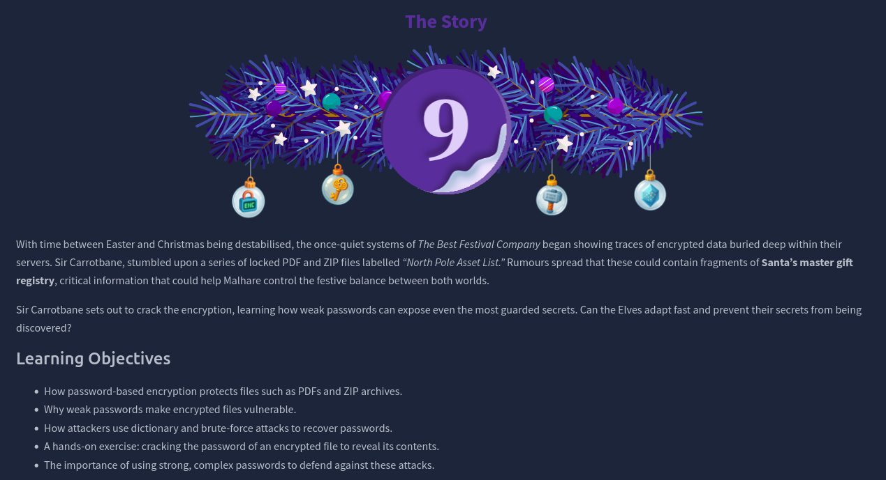
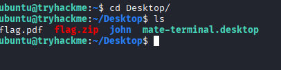
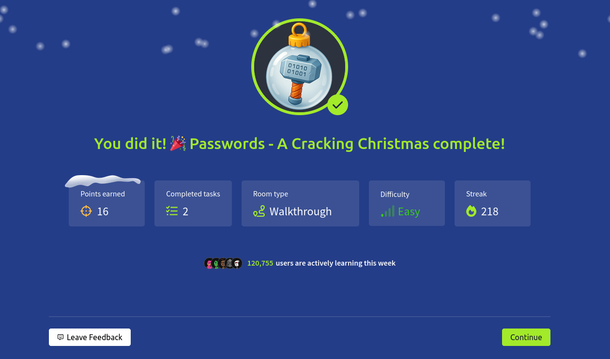

# Dia 9 - Passwords - A Cracking Christmas

  

### Objetivo

Este dia se va a enfocar en uno de los temas mas conocidos en la ciberseguridad, el crackeo de contraseñas, esta habitacion tiene el objetivo de:

- Como las contraseñas basadas en encripcion protegen archivos como PDFs o archivos ZIP
- Como la contraseñas debiles hacen que los archivos encriptados se vuelvan vulnerables
- Como los atacantes utilizan ataques de fuerza bruta o de diccionario para descubrir contraseñas
- Ejercicios de crackeo de archivos encriptados para revelar su contenido
- La importancia de usar contraseñas fuertes y complejas para defenderse de estos ataques

### Navegando por el desafio

La habitacion inicia explicando que los atacantes rara vez intentan vulnerar directamente la encriptacion aplicada a archivos como PDFs o ZIPs, los algoritmos modernos están diseñados para ser computacionalmente inviables de romper, incluso con hardware avanzado, en lugar de atacar la encriptacion, los atacantes se concentran en un punto mucho más debil, la contraseña que la protege, si la contraseña es predecible, corta o basada en patrones comunes, el archivo cifrado deja de ser seguro, sin importar cuán fuerte sea el algoritmo utilizado.

A partir de esto, se introduce el concepto de ataques de diccionario, una de las tecnicas más populares entre los atacantes, este metodo consiste en probar contraseñas tomadas de listas reales obtenidas de filtraciones, combinaciones comunes o palabras frecuentemente utilizadas por usuarios, debido a que una enorme cantidad de personas reutilizan contraseñas debiles o muy habituales, los ataques de diccionario se convierten en una forma rápida y extremadamente efectiva de recuperar accesos, la habitacion señala que estos ataques representan la primera opcion para cualquier atacante, ya que suelen ofrecer resultados inmediatos sin necesidad de grandes recursos.

Luego se explica como los atacantes pasan a ataques de fuerza bruta cuando los diccionarios no son suficientes, a diferencia de un diccionario, la fuerza bruta consiste en probar todas las combinaciones posibles de caracteres hasta encontrar la correcta, este proceso garantiza el exito, pero el tiempo necesario aumenta exponencialmente segun la longitud y complejidad de la contraseña, para optimizar este proceso, se utilizan variaciones donde el atacante restringe el patron a probar, por ejemplo, tres letras seguidas de dos numeros, esto reduce el espacio de busqueda y permite enfocarse en formatos más probables cuando se tiene alguna pista del estilo utilizado por el usuario.

Una vez explicados los fundamentos del crackeo de contraseñas, la habitacion introduce la parte practica, donde el usuario debe aplicar estas tecnicas en un entorno controlado, el ejercicio inicia con la identificacion del tipo de archivo a atacar, ya sea un PDF o un ZIP cifrado, la idea es que el usuario comprenda que antes de intentar cualquier ataque es fundamental reconocer el formato, porque de esto depende que herramientas son adecuadas para extraer o generar un hash crackeable.

  

Despues de esto, la habitacion explica como elegir las herramientas apropiadas para cada tipo de archivo. Se destacan utilidades como pdfcrack, fcrackzip, y principalmente John the Ripper, un programa versatil capaz de procesar hashes generados a partir de archivos cifrados mediante utilidades como zip2john o pdf2john, tambien se menciona Hashcat como la opcion mas avanzada cuando se dispone de GPU, aunque su uso no es obligatorio para completar el reto, el objetivo de esta seccion es que el usuario entienda que el proceso no consiste en "romper el cifrado", sino en transformar el archivo en un hash que pueda ser sometido a un ataque.

La habitacion muestra la importancia de iniciar siempre con un ataque de diccionario, esto refleja escenarios del mundo real, donde la mayoria de contraseñas son debiles y forman parte de listas ampliamente conocidas, como rockyou.txt, el usuario aprende que este tipo de ataque suele ser rapido, eficiente y suficiente para recuperar accesos en muchos casos, solo si el diccionario fracasa se sigue con metodos mas intensivos como fuerza bruta, que son mencionados como alternativas pero no explorados en profundidad dentro del reto.

Finalmente, la habitacion profundiza en un aspecto menos visible pero sumamente importante:

Como detectar actividades de crackeo en un entorno corporativo

Aunque el crackeo es un proceso offline que no genera fallos de autenticacion en redes o servicios, si produce senales en el equipo donde se ejecuta, la teoria presentada cubre como herramientas como John, Hashcat o PDFCrack dejan rastros en procesos, parametros de linea de comandos, archivos temporales y potfiles, tambien se explica por que el uso de GPU es altamente delatador debido al consumo extremo de recursos, un comportamiento que EDRs y agentes de monitoreo pueden identificar.

Ademas, la habitacion muestra ejemplos de reglas de deteccion para varios sistemas, incluyendo Sysmon, auditd y Sigma, que un SOC podria implementar para identificar intentos sospechosos de crackeo, todo esto se complementa con un pequeno playbook de respuesta que describe que pasos debe seguir un analista ante la deteccion de este tipo de actividad, como lo son:

- Aislar el host
- Capturar artefactos, 
- Preservar los directorios de trabajo, 
- Revisar accesos posteriores y, de ser necesario, escalar el incidente a un equipo de respuesta.

  

### Lecciones aprendidas

- Los archivos cifrados como PDFs o ZIPs no suelen ser atacados a traves de su algoritmo de encriptacion, sino mediante sus contraseñas, que en muchos casos son comunes o debiles.

- Los ataques de diccionario son una de las tecnicas mas efectivas y rapidas para recuperar contraseñas, ya que muchas personas utilizan contraseñas comunes o filtradas previamente, lo cual hace este metodo extremadamente eficiente.

- Cuando los diccionarios no son suficientes, los atacantes recurren a fuerza bruta los cuales pueden ser mas exhaustivos pero requieren mas tiempo y recursos, especialmente si la contrasena es compleja o larga.

- Herramientas como John the Ripper, Hashcat, pdfcrack y fcrackzip permiten transformar archivos cifrados en hashes crackeables, facilitando ataques que reflejan tecnicas usadas en escenarios del mundo real.

- Incluso si el crackeo se realiza de forma offline, deja rastros detectables en equipos y entornos corporativos, tales como procesos, parametros de linea de comandos, archivos temporales, potfiles y un uso elevado de GPU.

- Los equipos de seguridad pueden detectar este tipo de actividad mediante reglas especificas para Sysmon, auditd, Sigma o sensores EDR, los cuales permiten identificar patrones caracteristicos de herramientas y comandos de crackeo